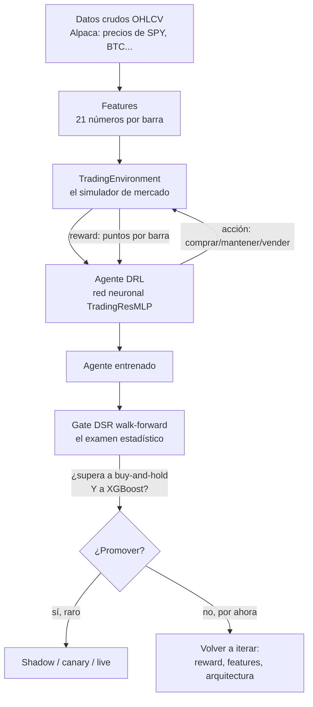

# Arquitectura del Bot y Cómo Aprende (explicado claro)

> Documento vivo para **entender** cómo funciona el bot — sobre todo la parte de
> deep learning / reinforcement learning, que es la que cuesta. Escrito con
> analogías a propósito. Última actualización: 2026-06-10.

---

## 0. El bot en una frase

> Un **agente de IA aprende a decidir comprar / mantener / vender** mirando un
> gráfico, **por ensayo y error** sobre años de historia real, y luego se somete
> a un **examen estadístico riguroso** antes de que se le confíe dinero.

Es como entrenar a un aprendiz de trader en un simulador: lo dejas practicar miles
de veces sobre el pasado, lo premias cuando acierta, y solo lo gradúas si demuestra
que su habilidad es **real** y no **suerte**.

---

## 1. El recorrido de los datos (la tubería completa)



Cada caja, en cristiano:

1. **Datos crudos** — el precio de un activo (apertura, máximo, mínimo, cierre,
   volumen) en cada barra de tiempo. Hoy: SPY diario, 2018-2026 (~1.476 barras).
2. **Features (21 números)** — no le damos el precio pelado al agente; le damos un
   "tablero de instrumentos": retornos recientes, RSI, MACD, volatilidad, en qué
   **régimen de mercado** estamos (calculado con un modelo GMM), y su propia
   posición. Es lo que un trader mira antes de decidir.
3. **El simulador (`TradingEnvironment`)** — reproduce la historia **barra por
   barra**. En cada paso le muestra el tablero al agente, recibe su decisión, y le
   devuelve cuántos "puntos" ganó.
4. **El agente** — una red neuronal que decide la acción. Es el cerebro que aprende.
5. **El examen (gate DSR)** — antes de confiar en él, lo prueba en periodos que
   **nunca vio** y lo compara contra estrategias simples. Solo pasa si su ventaja
   es estadísticamente creíble.

---

## 2. Cómo aprende el agente (esto es lo importante)

### 2.1 Las cuatro piezas del aprendizaje por refuerzo (RL)

Imagina enseñarle a alguien a jugar un videojuego que nunca vio, **sin manual**,
solo dejándolo jugar y diciéndole "bien" o "mal":

| Pieza | En el juego | En nuestro bot |
|-------|-------------|----------------|
| **Estado** (lo que ve) | La pantalla | Los 42 números del tablero en esa barra |
| **Acción** (lo que hace) | Botones | {-1 vender/corto, 0 fuera, +1 comprar/largo} |
| **Reward** (el marcador) | Puntos | El retorno que ganó esa barra menos costos |
| **Política** (su estrategia) | Lo aprendido | La red neuronal que mapea estado → acción |

El agente **no sabe nada al principio**. Aprende observando qué acciones, en qué
situaciones, le dan más puntos a largo plazo.

### 2.2 El bucle de aprendizaje, paso a paso

```
  ┌─────────────────────────────────────────────┐
  │  1. El simulador muestra el ESTADO (barra t) │
  │  2. El agente elige una ACCIÓN               │
  │  3. El simulador avanza a t+1 y da un REWARD │
  │  4. El agente AJUSTA su red con ese feedback │
  └──────────────────┬──────────────────────────┘
                     │  repetir ~252 veces = 1 EPISODIO (≈1 año)
                     │  repetir ~500 episodios = entrenamiento de un agente
                     ▼
```

Una **barra** es un paso. Un **episodio** es recorrer ~252 barras (un año
bursátil). El agente entrena ~500 episodios — o sea, "revive" el mismo periodo
cientos de veces, cada vez un poco más listo.

### 2.3 ¿Qué es exactamente lo que la red aprende? (DQN)

Usamos **DQN** (Deep Q-Network). La red aprende a estimar, para cada situación,
**"qué tan buena es cada acción a largo plazo"** — eso se llama el **Q-value**.

> **Analogía del ajedrez:** un jugador novato aprende, tras miles de partidas, que
> ciertas posiciones "huelen a victoria" y otras "a derrota". No calcula todo;
> reconoce patrones que históricamente llevaron a ganar. El Q-value es eso: una
> corazonada cuantificada de "si hago esta jugada aquí, ¿cómo me irá?".

La red mejora esas corazonadas con **aprendizaje por diferencia temporal**: compara
lo que **predijo** que ganaría con lo que **realmente** ganó (más lo que estima del
futuro), y ajusta sus pesos para reducir esa diferencia. Esa diferencia es el
**`loss`** que ves en los logs. (Ojo: en DQN el loss **sube** de forma natural al
principio y no es una nota de calidad — es solo cuánto se está corrigiendo.)

### 2.4 Explorar vs. explotar (el `eps` de los logs)

Al principio el agente **explora**: prueba acciones al azar para descubrir qué
funciona (`eps=1.0`, 100% aleatorio). Conforme aprende, **explota** lo aprendido
cada vez más (`eps` baja hacia 0.01).

> **Analogía:** cuando llegas a una ciudad nueva pruebas restaurantes al azar
> (exploras); cuando ya conoces, vuelves a tus favoritos (explotas). Empezar
> explorando evita casarse con la primera opción mediocre.

### 2.5 El backbone de la red: TradingResMLP

La red que hace todo esto es una **MLP residual** (ADR-038):

```
42 números → Linear → [Bloque Residual × N] → embedding(256) → Q-values
   bloque = LayerNorm → SwiGLU → Linear → Dropout → atajo (skip)
```

No necesitas el detalle. La idea: es una red profunda pero **estable** (los
"atajos"/skip connections evitan que se rompa al ser profunda, como pasamanos en
una escalera larga). El **mismo backbone** se reutiliza para DQN hoy y para PPO/SAC
mañana — solo cambia la "cabeza" final.

### 2.6 La escalera de algoritmos (dónde estamos)

No saltamos al algoritmo más complejo de golpe. Subimos peldaños (ADR-006):

```
Q-table tabular  →  [DQN ← AQUÍ ESTAMOS]  →  PPO  →  SAC
  (juguete)         (red neuronal,          (acción      (lo más
                     acción discreta)        continua)    eficiente)
```

Cada peldaño solo se sube si el anterior ya funciona. DQN es el actual.

---

## 3. Por qué no le creemos al agente sin más (la validación)

El peligro número uno en ML financiero es el **sobreajuste**: un modelo que se
aprende de memoria el pasado y luce brillante, pero fracasa en vivo.

> **Analogía:** un estudiante que memoriza las respuestas del examen del año pasado
> saca 10... hasta que le cambian las preguntas. Queremos medir si **entendió**, no
> si **memorizó**.

Por eso usamos dos defensas:

### 3.1 Walk-forward (examen con preguntas nuevas)

Entrenamos en un tramo del pasado y evaluamos en el tramo **siguiente**, que el
agente **nunca vio**. Repetimos en varios "folds" (ventanas) y juntamos todos los
resultados fuera de muestra (OOS). Un solo split engaña (lo vimos: el mismo agente
dio −0.19 y −11.26 solo por cambiar qué año caía en el examen). Varios folds dan un
veredicto robusto.

### 3.2 El gate DSR (el juez estadístico — ADR-040)

El **Deflated Sharpe Ratio** mide si la rentabilidad del agente es **real o suerte**,
y lo compara contra dos rivales honestos:

- **Buy-and-hold** (comprar y no tocar) — el rival a vencer.
- **XGBoost** (un modelo más simple) — para probar que el deep learning aporta algo.

Solo se promueve si el agente **supera a ambos** con estadística creíble. Es un
juez exigente a propósito: no queremos un edge fantasma que luego pierda dinero
real.

---

## 4. Qué se está trabajando AHORA (2026-06-10)

| Componente | Estado | Archivo |
|-----------|--------|---------|
| Loader de datos reales (Alpaca) | ✅ Funciona | `research/data/drl_dataset.py` |
| Simulador / env | ✅ + reward nuevo (ADR-041) | `research/envs/trading_env.py` |
| Agente DQN | ✅ Entrena | `research/models/drl/dqn_trainer.py` |
| Gate DSR walk-forward | ✅ + paralelizado | `research/models/drl/dsr_gate.py` |
| **Reward mark-to-market** | ✅ Recién implementado | `compute_reward_mtm` |
| Optuna (búsqueda de pesos) | 🔵 Infra lista, sin lanzar | `research/models/drl/reward_search.py` |
| PPO / SAC | ⚪ Roadmap | `research/models/drl/` |

### Modularidad: el agente es intercambiable (cualquier modelo encaja)

Hoy el "cerebro" es un DQN, y hay un XGBoost de baseline. Pero la arquitectura está
diseñada para que **agregar un modelo nuevo** (PPO, SAC, LSTM, Temporal Fusion
Transformer, redes de grafos…) sea **escribir una pieza nueva, sin tocar nada más**.

> Analogía: es como un **taladro con brocas intercambiables**. El taladro (la
> cartera, el riesgo, la ejecución, el examen) es siempre el mismo; la broca (el
> modelo) se cambia según el trabajo. Cada modelo nuevo es una broca que se enchufa
> en el mismo mandril — el contrato `AlphaAgent`. No rediseñas el taladro cada vez.

Lo que nunca cambia: lo que el agente **recibe** (`MarketContext`) y lo que
**entrega** (`TradeSignal`). Lo que varía: el modelo por dentro. Detalle técnico y
la "receta para añadir un modelo" en `ADR-042 §3.1`.

### El hallazgo que define el momento actual

El primer entrenamiento serio (SPY 2018-2026) dio:

> **DSR del agente = 0.85** (¡señal real, no ruido!), **le gana a XGBoost**, pero
> **pierde contra buy-and-hold** (Sharpe 0.55 vs 1.33).

Diagnóstico: el reward estaba **mal diseñado** — premiaba solo la ganancia
*realizada* (al cerrar), así que el agente no tenía incentivo para **montar las
tendencias**, y encima se le penalizaba por mantener posiciones. Por eso perdía
contra alguien que simplemente compra y no suelta en un mercado alcista.

**El fix (ADR-041, ya implementado):** ahora el reward es **mark-to-market** —
premia el retorno de la posición **cada barra**, no solo al cerrar. Esto alinea lo
que el agente entrena con lo que el examen mide. **Próximo paso: re-correr el gate
con el reward nuevo y ver si cierra la brecha contra buy-and-hold.**

---

## 5. Glosario rápido

| Término | En cristiano |
|---------|--------------|
| **Agente** | El cerebro que decide (la red neuronal) |
| **Estado** | Lo que ve el agente en una barra (42 números) |
| **Acción** | Comprar (+1), fuera (0), vender (-1) |
| **Reward** | Los puntos que gana cada paso |
| **Episodio** | Un recorrido de ~252 barras (1 año) |
| **Q-value** | "Qué tan buena es esta acción a largo plazo" |
| **Política** | La estrategia aprendida (estado → acción) |
| **eps (epsilon)** | Cuánto explora al azar (baja con el tiempo) |
| **loss** | Cuánto se está corrigiendo la red (no es nota de calidad) |
| **Walk-forward** | Entrenar en el pasado, examinar en el futuro no visto |
| **DSR** | Juez estadístico: ¿la ganancia es real o suerte? |
| **Buy-and-hold** | Comprar y no tocar — el rival a vencer |
| **Mark-to-market** | Valorar la posición a precio de mercado cada barra |
