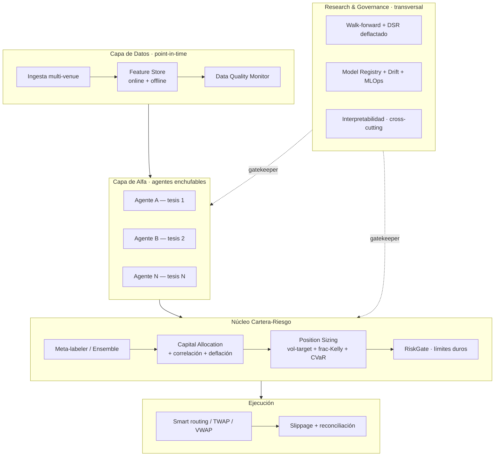

# Diagnóstico técnico — Arquitectura multiagente "FABLE 5"

> Revisión crítica desde la perspectiva de Arquitecto Principal de Sistemas
> Cuantitativos. Sin concesiones. Aterrizada en el estado real del sistema
> (2026-06-10): existe **un** agente DQN sobre SPY con DSR 0.85 que **aún no
> supera buy-and-hold**. Ese hecho condiciona todo el veredicto.

---

## 0. RESUMEN EJECUTIVO (el veredicto)

**Como visión / north star: 7/10.** Ambición coherente, cubre los ejes correctos
(modelos, riesgo, interpretabilidad), demuestra conocimiento del estado del arte.

**Como arquitectura construible hoy: 4/10.** Tres errores estructurales graves:

1. **Prioridades invertidas.** Se diseñan 5-6 librerías y una matriz de ~168 agentes
   *antes* de que un solo agente tenga edge robusto demostrado. Esto es exactamente
   cómo mueren los proyectos cuant: construir infraestructura para alfa que todavía
   no existe. Tu DQN no le gana a comprar y mantener SPY — no necesitas Graph Neural
   Networks ni Neural Architecture Search, necesitas **un** agente con edge OOS
   creíble.
2. **Taxonomía de agentes malformada.** "Activo × Estrategia × Modelo" como producto
   cartesiano mezcla tres ejes no ortogonales y genera celdas sin sentido
   (market-making + Forex diario + TFT). "Momentum" no es un modelo; es un sesgo
   inductivo. Un agente RL no "implementa momentum", lo aprende. Es un **error de
   categoría**.
3. **Se omite la capa verdaderamente difícil:** asignación de capital entre agentes
   correlacionados + sesgo de selección (meta-overfitting). En un fondo multiagente,
   ESE es el problema central, no el zoológico de modelos.

El resto de este documento desarrolla cada punto y propone la alternativa superior.

---

## 1. EVALUACIÓN DE LA ARQUITECTURA PROPUESTA

### 1.1 Qué está bien diseñado
- **El instinto de desacoplar en librerías.** Modularidad es correcto, aunque el
  *corte* esté mal (ver 1.3).
- **Incluir riesgo e interpretabilidad como ciudadanos de primera.** El 95% de los
  sistemas retail omiten ambos. Tenerlos en el diseño es maduro.
- **El menú de modelos es consciente del estado del arte** (TFT, N-BEATS, TCN,
  DeepAR, GNN). Demuestra lectura, aunque el 90% no se usará (ver F.4).

### 1.2 Qué está mal diseñado
- **El producto cartesiano Activo×Estrategia×Modelo.** 3×7×8 = 168 agentes, la
  mayoría absurdos. Estrategia y modelo no son ejes independientes. **Rediseño:** el
  agente debe especializarse por **hipótesis de alfa** (una tesis falsable sobre por
  qué hay edge), no por la combinatoria de etiquetas.
- **Interpretabilidad como "librería".** Es un *concern transversal* (un aspecto),
  no un paquete que importas. Y para RL, SHAP/LIME post-hoc sobre una política es en
  gran parte teatro (ver §3).
- **Estrategias y señales en la misma librería que factores.** Mezcla niveles de
  abstracción: un factor es un input; una estrategia es una política de decisión.

### 1.3 Qué falta (lo crítico, además de tu lista del §5)
- **Capa de datos point-in-time / survivorship / corporate actions.** "Librería de
  Activos" lista clases de activo pero nada del problema real: corrección
  point-in-time, sesgo de supervivencia, ajustes por splits/dividendos, sincronía de
  relojes cross-venue. Aquí es donde los sistemas multi-asset realmente se rompen.
- **Capa de asignación de capital + selección deflactada.** Con N agentes: (a) cómo
  repartir capital entre agentes **correlacionados**; (b) elegir el mejor de N
  backtests **infla descubrimientos falsos** — el DSR deflactado debe aplicarse a
  nivel de **selección de cartera**, no solo por agente.
- **Capa de coherencia datos↔features↔loss↔riesgo** (ver F.5).

### 1.4 Qué sobra (sobreingeniería para el estado actual)
- **AutoML + NAS + Meta-Learning** (ver F.6 y §6). En señal financiera de baja SNR,
  buscar arquitecturas es una **máquina de falsos descubrimientos**.
- **GNN, Transformers, TFT** sobre barras diarias de un activo (~1.500 muestras):
  data-hungry sobre datos data-poor.
- **Market-making y stat-arb como agentes** antes de tener infraestructura de
  microestructura y datos de order book: imposibles de validar hoy.

### 1.5 Qué escalaría mal
- **El registro/orquestación de 168 agentes** sin una capa de allocation: ingobernable.
- **Retraining nocturno de N modelos pesados** (TFT/GNN) sin presupuesto de cómputo
  ni gates de deflación: coste explosivo y overfitting sistémico.
- **Interpretabilidad por-modelo×estrategia×activo:** combinatoria de explicadores
  inmantenible si no se unifica detrás de una interfaz.

---

## 2. ARQUITECTURA PROFESIONAL (rediseño)

Pipeline en capas **Alfa → Cartera → Ejecución**, con agentes como *fuentes de alfa
enchufables* detrás de una interfaz uniforme. Los agentes NO tocan capital ni riesgo.



### 2.1 Módulos y responsabilidad única
| Módulo | Responsabilidad | NO hace |
|--------|-----------------|---------|
| `data` | Point-in-time, calidad, survivorship | Decidir features de estrategia |
| `features` | State space causal versionado | Persistir órdenes |
| `alpha/agents` | Producir **señal probabilística** | Sizing, riesgo, capital |
| `portfolio` | Ensemble, allocation, sizing | Conocer el modelo interno del agente |
| `risk` | Límites duros, kill switch (externo) | Optimizar retorno |
| `execution` | Convertir intent → fill | Generar señal |
| `research` | Walk-forward, DSR, deflación | Tocar producción |
| `governance` | Registry, drift, interpretabilidad | — |

### 2.2 Interfaces (el contrato es lo que importa)
```python
class AlphaAgent(Protocol):
    def predict(self, state: FeatureVector) -> Signal: ...
    #   Signal = {direction, p_win (calibrada), horizon, confidence,
    #             model_version, feature_set_hash, alpha_hypothesis_id}

class CapitalAllocator(Protocol):
    def allocate(self, signals: list[Signal], cov: Matrix,
                 perf: dict[AgentId, Track]) -> dict[AgentId, float]: ...

class PositionSizer(Protocol):
    def size(self, alloc: float, vol_forecast: float,
             regime: Regime, edge_posterior: Distribution) -> float: ...
```
Regla dura: **el agente devuelve `Signal`, nunca un tamaño ni una orden.** Esto
permite intercambiar XGBoost ↔ DQN ↔ TFT sin tocar cartera/ejecución.

### 2.3 Jerarquía de agentes
No "uno por celda de la matriz". Tres niveles:
1. **Agentes de alfa** — cada uno encarna **una hipótesis falsable** (p.ej. "el
   funding extremo en perp de BTC revierte en 8h"). Especializados por tesis, no por
   producto×modelo.
2. **Meta-coordinador** — ensembla/filtra señales (meta-labeling, stacking) y asigna
   capital con consciencia de correlación y deflación.
3. **Agentes operativos** (Monitor, Reactor, Reporter) — observabilidad y defensa,
   no generan alfa.

### 2.4 Flujo de datos
`raw (point-in-time) → features versionadas → Signal por agente → ensemble →
allocation (deflactada) → sizing (vol-target/Kelly/CVaR) → RiskGate → execution →
fills → atribución → governance/drift → retraining`.

---

## 3. CAPA DE INTERPRETABILIDAD (transversal, adaptada por modelo)

**Tesis crítica:** la interpretabilidad correcta depende del **tipo de modelo**, no
del activo ni (mucho) de la estrategia. Y para RL, la atribución de features es
secundaria — lo que importa es el **comportamiento de la política**.

| Técnica | Cuándo usarla | Cuándo NO |
|---------|---------------|-----------|
| **Feature importance (gain/permutation)** | Modelos tabulares (GBM): visión global rápida | Engaña con features correlacionadas |
| **SHAP** | GBM y NN tabulares: atribución local rigurosa, additividad | Caro en producción; sobre RL-policy = teatro |
| **LIME** | Explicación local rápida, modelo-agnóstica | Inestable, frágil ante perturbaciones; evitar como única fuente |
| **Attention maps** | Transformers/TFT: qué pasos/variables pesan | La atención ≠ explicación causal (Jain & Wallace 2019) |
| **Counterfactuals** | "¿qué cambio mínimo invierte la decisión?" — auditoría de robustez | Costoso; cuidado con counterfactuals no realizables |
| **Explainable RL** | **EL método para agentes RL** | — |
| **Saliency / Integrated Gradients** | NN profundas (CNN-TS, TFT) | Ruidoso en baja SNR |

### 3.1 Interpretabilidad de RL (lo que tu sistema necesita YA)
Para el DQN actual, SHAP sobre los Q-values aporta poco. Lo accionable:
- **Distribución de acciones por régimen** — ¿se pone largo/corto/flat según el GMM?
- **State-visitation / policy heatmap** — qué zonas del espacio de estado visita.
- **Counterfactual rollouts** — re-simular el episodio forzando acciones alternativas.
- **Saliency sobre el estado** — qué de los 42 inputs mueve la acción.
- **Reward decomposition** — cuánto del reward viene de PnL vs penalizaciones.
> Esto responde tu preocupación real ("¿qué estrategia aprendió?") con números, no
> con una caja negra. Ya tienes `error_analysis.py` como base.

### 3.2 Diseño
Una **interfaz `Explainer`** con implementaciones registradas por tipo de modelo;
el sistema selecciona el explicador automáticamente (`tabular→SHAP`, `policy→XRL`,
`transformer→attention+IG`). NO una librería monolítica.

---

## 4. POSITION SIZING AVANZADO

| Método | Fortaleza | Debilidad fatal | Veredicto institucional |
|--------|-----------|-----------------|-------------------------|
| **Kelly full** | Óptimo log-growth teórico | Asume que conoces el edge real; explosivo, fat-tailed | ❌ Nunca solo |
| **Fractional Kelly (¼–½)** | Reduce varianza ~drásticamente con poco coste de crecimiento | Sigue dependiendo de estimar el edge | ✅ Componente base |
| **Risk Parity** | Diversificación por contribución de riesgo | Régimen-ciego; asume vol = riesgo | ✅ Para multi-activo |
| **Volatility Targeting** | Empíricamente robusto; mejora Sharpe y colas; model-free | No usa el edge | ✅✅ El caballo de batalla |
| **Bayesian Sizing** | Incorpora **incertidumbre de parámetros** → encoge el tamaño | Requiere posterior del edge | ✅ La forma correcta de Kelly |
| **Monte Carlo** | Controla ruina/drawdown vía simulación de paths | Caro; sensible al modelo generador | 🔵 Para validar límites |
| **CVaR Optimization** | Acota expected shortfall; medida **coherente** (≠ VaR) | Caro; sensible a colas mal estimadas | ✅ Constraint dura |
| **Utility-based (CRRA)** | Generaliza Kelly; principiado | Sensible a la spec de utilidad | 🔵 Marco unificador |
| **Regime-dependent** | Condiciona tamaño al régimen | Hereda error del detector de régimen | ✅ Modulador |

**Recomendación (no un método, un *stack*):**
```
size = VolTarget(vol_forecast)                      # escalar base, robusto
       × FractionalKelly(edge_posterior, cap=0.25)  # modulado por edge bayesiano
       × RegimeFactor(regime)                        # atenúa en régimen adverso
   sujeto a   CVaR_95(portfolio) ≤ límite            # constraint dura (overlay)
              y RiskGate (caps, kill switch)          # externo, no negociable
```
El más robusto **standalone** es **vol-targeting**; el más robusto **completo** es el
stack de arriba. Kelly puro o Monte Carlo solos son frágiles. Tu repo ya tiene
`kelly.py`, `bayesian_sizer.py`, `dynamic_rr.py` — falta el vol-target como base y el
CVaR como overlay.

---

## 5. VACÍOS CONCEPTUALES

De tu propia lista, clasificados por gravedad de omisión:

| Elemento | ¿Presente en la propuesta? | Gravedad si falta |
|----------|---------------------------|-------------------|
| Walk-Forward Validation | Implícito | 🔴 Crítico (ya implementado, ADR-040) |
| Capital Allocation Layer | Listado, no diseñado | 🔴 Crítico — es el núcleo de un fondo multiagente |
| Agent Coordination | Listado, no diseñado | 🔴 Crítico |
| Concept Drift / Data Quality | Ausente del diseño real | 🔴 Crítico en multi-asset |
| Model Governance / MLOps | Ausente | 🟠 Alto |
| Regime Detection | Presente (GMM) | 🟢 Cubierto |
| Backtesting Infra | Presente (WF runner) | 🟢 Cubierto |
| Execution Engine | Presente (platform) | 🟢 Cubierto |
| Ensemble / Meta-Learning | Mencionado | 🟠 Alto (meta-labeling existe) |
| Online Learning | Mencionado | 🟡 Deseable, peligroso en risk-path |
| Portfolio Optimization | Listado | 🟠 Alto |

**Vacíos que NO están en tu lista y son los más peligrosos:**
- **Sesgo de selección / deflación a nivel de cartera** (multiple testing across agents).
- **Point-in-time correctness** y survivorship.
- **Capacidad / liquidez / market impact** (un alfa que no escala no es alfa).
- **Alpha decay monitoring** (las estrategias mueren; hay que medir su vida media).
- **Atribución de P&L** (sin ella no sabes qué agente aporta y cuál destruye).

---

## 6. VIABILIDAD REAL (clasificación)

| Componente | Clasificación |
|-----------|---------------|
| Walk-forward + DSR gate | **Imprescindible** (hecho) |
| Vol-targeting + fractional-Kelly + RiskGate | **Imprescindible** |
| Feature store point-in-time | **Imprescindible** |
| Capital allocation + deflación de selección | **Imprescindible** (al pasar a N agentes) |
| Interpretabilidad RL (policy behavior) | **Imprescindible** |
| Ensemble / meta-labeling | **Deseable** |
| Regime-dependent sizing | **Deseable** |
| CVaR overlay | **Deseable** |
| Multi-asset (crypto + equity) | **Deseable** (tras 1 agente sólido) |
| TFT / N-BEATS / DeepAR | **Experimental** (solo intradía o pooled cross-section) |
| GNN para activos | **Experimental** |
| Online learning en path de riesgo | **Experimental / peligroso** |
| AutoML / NAS | **Sobreingeniería** (hoy destruye valor por overfitting) |
| Matriz 168 agentes | **Sobreingeniería** |
| Market-making sin order book data | **Sobreingeniería** (inviable hoy) |

---

## 7. HOJA DE RUTA

**Nivel 1 — MVP funcional (donde casi estás; TERMÍNALO antes de escalar).**
Un activo, un agente (DQN), walk-forward + DSR gate, vol-target+frac-Kelly sizing,
interpretabilidad de política. **Criterio de salida: un agente que supere
buy-and-hold y XGBoost OOS con DSR deflactado > 0.4.** Hasta cumplirlo, no avanzar.

**Nivel 2 — Profesional.**
2-3 agentes por **hipótesis de alfa** distinta (no por matriz), interfaz `Signal`
uniforme, capital allocation simple (inverse-vol/risk-parity entre agentes con
deflación), MLOps real (registry, drift, retraining gated), meta-labeling, datos
point-in-time. Atribución de P&L por agente.

**Nivel 3 — Institucional.**
Multi-asset, allocation condicionada a régimen, CVaR portfolio constraint, model
governance + audit trail, execution con microestructura, observabilidad completa,
walk-forward en CI nocturno, monitoreo de alpha decay.

**Nivel 4 — Hedge fund.**
Modelado de capacidad/liquidez/impacto, neutralización por factores, atribución
multi-nivel, cross-region/DR, compliance, escalado de capital, meta-coordinador de
agentes (bandit/RL) sobre cartera de alfas con turnover y costes reales.

> Regla: **cada nivel exige que el anterior pase su gate.** Saltar niveles es el
> modo de fallo número uno.

---

## 8. META-EVALUACIÓN

**¿Qué tan sólida es la arquitectura?** Como visión, sólida; como plan ejecutable,
frágil por prematuridad y por el corte erróneo de los ejes de especialización. La
distancia entre "un DQN que no bate SPY" y "plataforma multiagente multi-modelo" es
de **años-persona**, y la propuesta no jerarquiza ese camino.

**Principales riesgos (ordenados):**
1. **Explosión de scope / nunca enviar nada productivo.** El riesgo dominante.
2. **Meta-overfitting:** seleccionar el mejor de N agentes sin deflactar = alfa
   fantasma a escala industrial.
3. **Capital allocation sin resolver:** el problema central de un fondo, listado pero
   no diseñado.
4. **Deuda de infraestructura de datos** (point-in-time, calidad) que aflora tarde y
   caro.
5. **Complejidad > capacidad del equipo/cómputo.**

**Cambios de mayor impacto (haz estos primero):**
1. **Colapsar la taxonomía de agentes** → especialización por hipótesis de alfa
   detrás de una interfaz `Signal` uniforme.
2. **Hacer la asignación de capital + deflación de selección un ciudadano de primera**
   desde el día 1 del multiagente.
3. **Acotar la complejidad del modelo a la SNR/N** (GBM por defecto; DL solo con
   datos que lo justifiquen).
4. **Interpretabilidad como aspecto transversal y RL-específico**, no librería.
5. **Terminar el Nivel 1** antes de cualquier otra cosa.

**¿Cómo rediseñaría FABLE 5 desde cero?** Exactamente el pipeline en capas de §2:
`Datos point-in-time → Agentes-de-alfa (Signal uniforme) → Núcleo Cartera-Riesgo
(ensemble + allocation deflactada + sizing en stack + RiskGate) → Ejecución`, con
`Research/Governance` (walk-forward + DSR + drift + interpretabilidad) como
**gatekeeper transversal**. Agentes intercambiables; el valor vive en el núcleo de
cartera y en el harness de validación, no en el zoológico de modelos.

**¿Cuándo usar el modelo Fable 5 (Anthropic) para construir esto?** Para los builds
largos y de alto contexto (el núcleo de allocation, el execution engine, el harness
de deflación) a esfuerzo alto; Opus 4.8 para el diseño matemático/riesgo y la revisión
de leakage; agentes baratos (Composer) para wiring y tests. No delegues a ningún
modelo el **diseño del criterio de promoción/deflación**: ahí un error es alfa
fantasma con dinero real.

---

## F. CAPA DE MACHINE LEARNING Y DEEP LEARNING

### F.1–F.3 Mapa Librería → Problema → Modelo → Loss → Métrica

| Caso de uso | Tipo de problema | Modelo recomendado | Loss / Reward | Métrica de evaluación |
|-------------|------------------|--------------------|---------------|------------------------|
| **Signal generation (dirección)** | Clasificación 2-3 clases | XGBoost / LightGBM | Focal / BCE (ponderada por |retorno|) | PnL-weighted F1, no accuracy pelada |
| **Return forecasting** | Regresión / forecasting | TFT o N-BEATS *solo si hay estructura+datos*; si no, GBM | Huber / Quantile | OOS R², Directional Accuracy |
| **Forecasting probabilístico** | Forecasting distribucional | DeepAR, TFT-quantile | Quantile / **CRPS** | CRPS, coverage de intervalos |
| **Regime detection** | Clustering / clasif. no sup. | **GMM / HMM** (no Transformer aún) | NLL | regime stability, Macro-F1 (si hay labels) |
| **Risk forecasting (vol)** | Forecasting | **HAR / GARCH baseline**; LSTM solo si supera | QLIKE / Gaussian NLL | QLIKE, RMSE de vol |
| **Position sizing** | Control / optimización (no "predicción") | RL o regla bayesiana | Expected utility / **CVaR / Kelly-opt** | growth rate, MaxDD, Calmar |
| **Portfolio allocation** | Optimización con restricciones | Mean-variance Ledoit-Wolf; Deep Portfolio *con cautela* | **Sharpe / Sortino loss** | OOS Sharpe, turnover, MaxDD |
| **Signal filtering** | Clasificación (meta-label) | XGBoost meta-labeler | BCE | precision del filtro |
| **Execution optimization** | RL / control microestructura | RL (PPO) o reglas | **Implementation Shortfall / slippage** | IS bps vs arrival price |
| **Direction/timing (control)** | Reinforcement Learning | DQN → PPO → SAC | **reward risk-adjusted, DSR-aware** | **DSR OOS** (lo tuyo) |
| **Anomaly / fraud de datos** | Anomaly detection | Isolation Forest / autoencoder | recon error | precision@k de alertas |

**Punto crítico (la lección de TU proyecto):** la loss/reward debe ser el **objetivo
financiero directo** (retorno ajustado por riesgo), no un proxy estadístico. Optimizar
*accuracy* ≠ optimizar PnL: puedes acertar 60% y perder dinero si el 40% son los
movimientos grandes. Esto es **exactamente** el bug que arreglamos con el reward
mark-to-market (ADR-041): entrenabas para P&L realizado y evaluabas mark-to-market.

### F.4 Cuándo ML clásico vs DL vs RL vs híbrido

| Paradigma | Úsalo cuando… | Justificación |
|-----------|---------------|---------------|
| **ML clásico (GBM)** | Tabular, N pequeño-medio, baja SNR — **el 80% de los casos** | Mejor robustez SNR, interpretable, rápido, difícil de batir en tabular financiero |
| **Deep Learning (TFT/LSTM/TCN)** | Estructura secuencial real **Y** datos suficientes (intradía/tick o cross-section agrupada) | Data-hungry; rara vez justificado en diario de un activo (~1.500 muestras) |
| **RL** | Decisión secuencial con dependencia de path y objetivo de reward acumulado (gestión de posición, ejecución, sizing-como-control) | NO para predicción pura |
| **Híbrido** | La respuesta institucional pragmática | GBM/forecaster para señal → RL/optimizador para sizing y ejecución → meta-labeler para filtrar. Cada herramienta donde es fuerte |

**Veredicto:** tu entusiasmo por GNN/TFT/Transformers choca con la realidad de tus
datos (diario, baja SNR, no estacionario, N chico). **Empareja la complejidad del
modelo a la SNR y al tamaño muestral.** Hoy, GBM + RL-para-control + ensemble batiría
a cualquier GNN, y es mantenible.

### F.5 Coherencia datos↔features↔estrategias↔modelos↔loss↔riesgo

Incompatibilidades detectadas en la propuesta:
- **TFT/GNN ↔ datos diarios:** incoherente (modelo data-hungry, datos data-poor).
- **Loss MSE/accuracy ↔ objetivo PnL:** incoherente (optimiza lo que no importa).
- **Estrategia "market-making" ↔ datos sin order book:** incoherente (no validable).
- **Online learning ↔ path de riesgo:** incoherente con gobernanza (no aprendas en
  vivo donde puedes quebrar la cuenta).
- **AutoML/NAS ↔ baja SNR:** incoherente (multiplica el sesgo de selección; el DSR
  deflactado se dispara y nada pasa el gate, o peor, pasa basura).

**Rediseño de coherencia:** un único `state space` versionado alimenta a todos los
agentes; cada agente declara su `alpha_hypothesis` y su `loss` alineada al objetivo
financiero; el sizing y el riesgo viven fuera del agente; el harness de validación
(walk-forward + DSR deflactado) es el único árbitro. Sin esa columna vertebral, las
librerías desacopladas se vuelven islas incoherentes.

### F.6 Capa de AutoML institucional — ¿conviene?

| Componente | Veredicto |
|-----------|-----------|
| Optimización bayesiana (Optuna) de hiperparámetros | ✅ **Sí**, con budget capado y **deflación honesta del DSR** por nº de configs evaluadas OOS |
| Selección automática de features | 🟠 **Con cuidado** — solo dentro del train del fold (anti-leakage); el SHAP/gain como guía, no automático ciego |
| Selección automática de modelos | 🟡 **Limitada** — un pool pequeño (GBM, ResMLP, baseline), no búsqueda abierta |
| **Neural Architecture Search** | ❌ **No** — en señal financiera de baja SNR es una máquina de falsos descubrimientos. Coste enorme, ROI negativo |
| Meta-Learning (learning-to-learn) | ❌ **Experimental** — no antes del Nivel 3, y con escepticismo |

**Conclusión AutoML:** sí a Optuna acotado y deflación-aware (ya está previsto en
ADR-041 §5, subordinado al fix estructural); **no** a NAS/meta-learning. En finanzas,
**cuanto más buscas, más sobreajustas**: el AutoML sin disciplina de deflación
*destruye* valor. La regla de oro: cada configuración evaluada OOS sube la vara del
DSR. Búsqueda barata → embudo → gate caro solo en finalistas.

---

## Cierre

La propuesta "FABLE 5" es una buena **brújula** y un mal **mapa de ruta**. El mayor
acto de ingeniería ahora no es añadir GNNs ni AutoML: es **terminar el Nivel 1** —
un solo agente con edge robusto y deflactado — y construir el **núcleo de cartera
(allocation + sizing + deflación de selección)**, que es donde de verdad vive el
valor de un fondo multiagente. Todo lo demás es prematuro hasta cruzar ese umbral.
