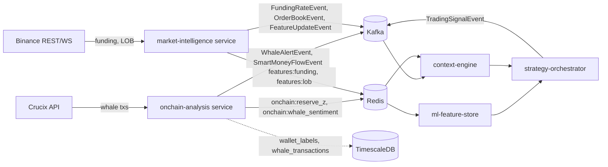
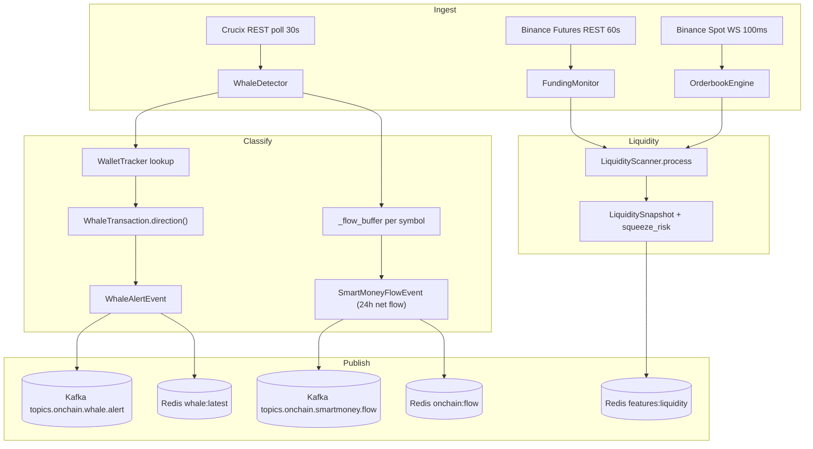
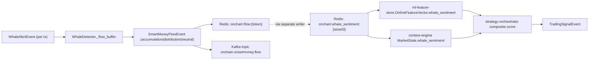

# ONCHAIN.md — On-Chain Intelligence System

> **Internal technical reference.** Centralized documentation for the on-chain
> intelligence module of `quant_bot`. Grounded **exclusively** in code present
> in the repository as of 2026-05-14. Anything unverified is flagged as
> *Pending validation*.

> **Scope note**: on-chain intelligence in this repo is implemented in the
> `platform/` layer (the production microservices). The `research/` layer does
> not currently consume on-chain features at training time — see §6.

---

## Index

1. [On-Chain System Overview](#1-on-chain-system-overview)
2. [On-Chain Architecture](#2-on-chain-architecture)
3. [On-Chain Metrics Analysis](#3-on-chain-metrics-analysis)
4. [Existing Project Modules](#4-existing-project-modules)
5. [Data Infrastructure](#5-data-infrastructure)
6. [Simulations and Validation](#6-simulations-and-validation)
7. [Signal Generation System](#7-signal-generation-system)
8. [Risks and Vulnerabilities](#8-risks-and-vulnerabilities)
9. [Technical Roadmap](#9-technical-roadmap)
10. [Institutional Recommendations](#10-institutional-recommendations)
11. [Maturity Assessment & Transformation Plan](#11-maturity-assessment--transformation-plan)

---

# 1. On-Chain System Overview

## 1.1 Purpose

The on-chain module ingests, classifies and aggregates large blockchain
transactions and derivatives liquidity signals, exposes them as canonical
Kafka events and Redis-cached features, and lets downstream services
(`ml-feature-store`, `context-engine`, `strategy-orchestrator`) consume them
as inputs for signal generation and risk decisions.

Concretely, the implemented capabilities are:

| Capability | Owner module | Verified in code |
|------------|--------------|------------------|
| Whale transaction detection (≥ N USD) | `WhaleDetector` ([`platform/services/onchain-analysis/app/whale_detector.py`](platform/services/onchain-analysis/app/whale_detector.py)) | Yes |
| CEX inflow / outflow classification | `WhaleTransaction.direction` | Yes |
| Net flow & smart-money aggregation per asset | `WhaleDetector._compute_net_flows` | Yes |
| Wallet labeling (CEX hot/cold, funds, DeFi) | `WalletTracker` ([`wallet_tracker.py`](platform/services/onchain-analysis/app/wallet_tracker.py)) + in-code dictionary | Yes |
| Derivatives liquidity / squeeze risk | `LiquidityScanner` ([`liquidity_scanner.py`](platform/services/onchain-analysis/app/liquidity_scanner.py)) | Yes |
| Funding rate monitoring | `FundingMonitor` (market-intelligence service, [`funding_monitor.py`](platform/services/market-intelligence/app/binance/funding_monitor.py)) | Yes |
| Order-book imbalance (CEX) | `OrderbookEngine` ([`orderbook_engine.py`](platform/services/market-intelligence/app/binance/orderbook_engine.py)) | Yes |
| Whale sentiment → strategy signal | `strategy-orchestrator` composite score | Yes |

## 1.2 Role inside the trading ecosystem



On-chain signals feed the bot in two parallel channels:

1. **Real-time path**: `onchain-analysis` → Redis (`onchain:whale_sentiment:*`, `onchain:reserve_z:*`) → `ml-feature-store` (online features) → `strategy-orchestrator` (composite score).
2. **Event path**: `onchain-analysis` → Kafka topics (`onchain.whale.alert`, `onchain.smartmoney.flow`) → `context-engine.MarketState` → orchestrator.

## 1.3 Operational scope

- **Blockchains targeted**: `bitcoin`, `ethereum` (default in `WhaleDetector._blockchains`). The runtime list is widened by `ONCHAIN_ASSETS` env var (default `BTC,ETH,SOL`).
- **Whale threshold**: `WHALE_THRESHOLD_USD = 1_000_000` (env-overridable).
- **Polling interval**: `POLL_INTERVAL_S = 30 s` (whale detector); `60 s` for funding monitor.
- **Window**: 24 h rolling net flow for `SmartMoneyFlowEvent` (last 50 transactions).

## 1.4 Current and future integrations

| Source | Status | Evidence |
|--------|--------|----------|
| Crucix REST (`/v1/large-transactions`) | Active (implementation) | `WhaleDetector._poll_blockchain` |
| Binance USDT-M perpetuals REST | Active | `FundingMonitor._poll_symbol` |
| Binance spot WS depth | Active | `OrderbookEngine._stream_symbol` |
| Etherscan / Arkham / Nansen wallet labels | **Not implemented** — comment in code labels `WalletTracker` seed list as "simplified, use Arkham/Nansen in prod". | *Pending validation* |
| Glassnode / Dune / SOPR / MVRV metrics | **Not implemented** | `CLAUDE.md` §3.6 cites them as targets only |
| MEV/sandwich/sandwich detection | **Not implemented** | No code matches `MEV`, `sandwich`, `frontrun` |
| Cross-chain bridge tracking | **Stubbed** — listed in `WhaleDetector` docstring (item 4) but no implementation path beyond Crucix passthrough |

---

# 2. On-Chain Architecture

## 2.1 Supported exchanges & blockchains

- **Exchanges with labelled wallets** (`WalletTracker.KNOWN_WALLETS` + `whale_detector.KNOWN_WALLETS`): Binance (hot/cold/fund 2), Coinbase (hot/cold/pro), Kraken, OKX. DeFi routers: Uniswap V2, Uniswap V3.
- **Blockchains**: Bitcoin, Ethereum hard-coded in `WhaleDetector` defaults; the schema accepts `solana` and any string via `WhaleAlertEvent.blockchain`.
- **Asset universe at the service level**: `ONCHAIN_ASSETS` env (default `BTC,ETH,SOL`).

## 2.2 APIs, WebSockets, indexers, RPC providers

| Source | Type | Endpoint | Module |
|--------|------|----------|--------|
| Crucix | REST poll | `${CRUCIX_BASE_URL}/large-transactions` | `whale_detector.py` |
| Binance Futures | REST poll | `${BINANCE_FUTURES_BASE}/premiumIndex` | `funding_monitor.py` |
| Binance Spot | REST snapshot + WS diff | `${BINANCE_REST_BASE}/depth`, `${BINANCE_WS_BASE}/<symbol>@depth@100ms` | `orderbook_engine.py` |
| Direct RPC (Geth/Erigon, BTC Core) | **Not implemented** | n/a | — |
| The Graph / Subsquid indexers | **Not implemented** | n/a | — |
| Etherscan / Blockchair | **Not implemented** | n/a | — |

There is **no native blockchain RPC client** in the repo. All on-chain truth
is delegated to Crucix. This is a critical dependency (see §8).

## 2.3 Data flow architecture



## 2.4 Latency & synchronization

| Stage | Mechanism | Effective latency |
|-------|-----------|-------------------|
| Crucix → `WhaleDetector` | Polling every 30 s | up to 30 s + provider lag |
| `WhaleDetector` → Kafka | `await self._producer.send(...)` per event | < 100 ms |
| Kafka → `context-engine` | Async consumer, state rebuilt every `STATE_INTERVAL` | seconds |
| Redis cache TTL for whale | `TTL["whale"]` (defined in `redis_client`) | *Pending validation of exact value* |
| Idempotency | `self._seen_txs: set[str]` keeps already-processed tx hashes in memory | resets on restart |

There is **no explicit ordering guarantee** beyond Kafka partition order; the
`WhaleAlertEvent` carries `event_id` (UUID v4) and `ts` so consumers can
re-sort, but no Lamport/sequence id per chain is enforced.

---

# 3. On-Chain Metrics Analysis

The following metrics are **actually computed in the codebase**. Anything else
listed in the user request (e.g. token velocity, gas analysis, MEV) is flagged
as *not implemented*.

## 3.1 Whale activity

- **What it does**: detects on-chain transfers above `WHALE_THRESHOLD_USD`.
- **How it is calculated**: poll Crucix `/large-transactions?min_usd=...`; parse into `WhaleTransaction`; emit `WhaleAlertEvent`.
- **Strategic usefulness**: discrete on-chain events that often precede CEX-side price reactions. Used as raw alert and as input to net-flow aggregation.
- **Limitations / risks**: depends entirely on Crucix labelling quality; threshold is global (no per-asset normalization); `_seen_txs` is in-memory only (memory growth on restart-free long uptime is bounded by Crucix dedup logic — *pending validation* under heavy load).

## 3.2 Smart money tracking

- **What it does**: aggregate per-asset rolling flow to produce an "accumulation" / "distribution" / "neutral" label.
- **How it is calculated** (`WhaleDetector._compute_net_flows`):
  - For each token: `flow = +amount_usd` if `direction == exchange_outflow` else `-amount_usd`.
  - Push to ring buffer of last 50 entries.
  - `accum_score = % of positive flows in last 50 × 100`.
  - Label: `accumulation` if `accum_score > 60`, `distribution` if `< 40`, else `neutral`.
  - `confidence = |accum_score - 50| / 50`.
- **Strategic usefulness**: feeds `whale_sentiment` feature consumed by `strategy-orchestrator` (composite score with weight 0.2) and `context-engine`.
- **Limitations**: 50-tx window is sample-count, not time-bounded; in slow markets it spans much more than 24 h, breaking the "24h" label of the event field (`net_flow_exchange_24h`).

## 3.3 Wallet clustering / labeling

- **What it does**: maps an address → entity (exchange, fund, miner, DeFi) and a CEX-or-not flag.
- **How it is calculated**: hard-coded seed dict (`KNOWN_WALLETS`) merged with Postgres `onchain.wallet_labels` if a DSN is configured (`WalletTracker._load_from_db`).
- **Strategic usefulness**: enables the inflow/outflow classification in §3.1; without it, every whale tx is `unknown ↔ unknown`.
- **Limitations**: tiny seed coverage (≤ 15 hot/cold wallets); no automated heuristic clustering despite the docstring claim ("Clasificación automática por heurísticas" is *not implemented* — only DB-backed lookups).

## 3.4 Liquidity flows (exchange reserves)

- **What it does**: tracks exchange reserve balances and computes z-score vs 30-day rolling.
- **How it is calculated** (`LiquidityScanner.process`): consumes `exchange_reserve` from input dict, pushes to `deque(maxlen=720)` (30 d in hourly bars), computes `(x - mean) / std`.
- **Strategic usefulness**: feature `reserve_z` consumed by `feature_streaming` and stored in Redis (`onchain:reserve_z:{ASSET}`).
- **Limitations**: **the upstream of `exchange_reserve` is not implemented** in `onchain-analysis/app/main.py` — `LiquidityScanner.process` is defined but no poller wires Crucix/Glassnode reserve series into it. *Pending validation of any external caller.*

## 3.5 Token velocity

- **Not implemented.** No code matches velocity, money flow as defined in classic on-chain analytics.

## 3.6 Stablecoin flows

- **Not implemented.** USDT/USDC mint/burn or exchange flows are not tracked.

## 3.7 Funding rates (perpetual derivatives)

- **What it does**: poll Binance USDT-M perpetuals for `lastFundingRate`, compute z-score vs rolling 60-period window, basis (mark vs index, mark vs spot), annualized funding %.
- **How it is calculated** (`FundingMonitor._compute_features`):
  - `funding_z_score = (rate - mean(history)) / std(history)`
  - `funding_basis_bps = (mark - index) / index × 10_000`
  - `annual_funding_pct = rate × 3 × 365 × 100`
- **Strategic usefulness**: feeds `LiquidityScanner` (funding_z dimension of squeeze risk) and is published as `features:funding:{SYMBOL}` in Redis.
- **Limitations**: only Binance Futures USDT-M; no aggregation across venues (Bybit, OKX, dYdX).

## 3.8 Open Interest

- **What it does**: tracks open interest USD, z-score vs 30 d rolling.
- **How it is calculated**: `LiquidityScanner` z-score on `open_interest_usd` input.
- **Strategic usefulness**: dimension of `squeeze_risk` classifier (`oi_z > 2 → +1 point`).
- **Limitations**: same as §3.4 — **no caller** wires OI data into `LiquidityScanner` in the current `main.py`. The scanner is a library waiting for a feeder.

## 3.9 Exchange inflows / outflows

- Covered in §3.1 + §3.2. Direction inferred from `from_type` and `to_type` labels on `WhaleTransaction`.

## 3.10 DEX activity

- **Partially modelled**: `WhaleTransaction.direction` returns `defi_deposit` / `defi_withdrawal` when the counterparty type is `defi_protocol`. Only Uniswap V2 / V3 routers are pre-labelled.
- **Schema field**: `SmartMoneyFlowEvent.dex_volume_24h` exists but is hard-coded to `0.0` in `_compute_net_flows`. Not implemented.

## 3.11 MEV activity

- **Not implemented.** No MEV bot detection, sandwich/back-run identification, Flashbots private mempool integration.

## 3.12 Gas analysis

- **Not implemented.** No gas price feed, no priority-fee analysis, no mempool sniffing.

## 3.13 Volume anomalies

- **Implemented at orderbook level** (not strictly on-chain): `OrderbookEngine.compute_features` produces `lob_depth_total_10`, `lob_imbalance_5/10`, `lob_weighted_mid`, `lob_spread_bps`. On-chain volume anomalies (e.g. burst of large transfers) are **not** computed; only counts of transfers above threshold.

## 3.14 Order flow imbalance

- **Implemented for CEX**: `LOBSnapshot.imbalance(n)` returns `(bid_vol − ask_vol) / total`, in [−1, +1], top-N levels.
- **Not implemented on-chain** (e.g. DEX swap imbalance per pool).

## 3.15 Liquidation maps

- **Partially implemented**: `LiquidityScanner` accepts `long_liq_1h` and `short_liq_1h` and produces:
  - `liq_imbalance = (long − short) / total ∈ [−1, +1]`
  - Component of `squeeze_risk` (`|liq_imbal| > 0.7 → +0.5`).
- **Limitation**: it computes scalar 1 h totals; **no liquidation heatmap** (price-level cluster map) exists. The "liq map" capability listed by the user request is **not** present.

## 3.16 Cross-chain activity

- **Mentioned, not implemented.** `WhaleDetector` docstring lists "Cross-chain bridge activity" as goal #4 but no bridge address registry, no chain-bridging classification.

---

# 4. Existing Project Modules

Classification policy:
- **Stable** = covered by tests and used in production wiring.
- **Critical** = stable AND on the live signal path.
- **Experimental** = exists in code but lacks callers/tests, or is partial.
- **Obsolete** = referenced only by legacy archive (`research/archive/`) or unused.

| Component | Path | Role | Tests | Class |
|-----------|------|------|-------|-------|
| `WhaleDetector` | `platform/services/onchain-analysis/app/whale_detector.py` | Whale tx detection, classification, net-flow emission | None in repo | **Critical (untested)** |
| `WalletTracker` | `platform/services/onchain-analysis/app/wallet_tracker.py` | Address → label lookup, in-memory + Postgres | None | Stable (small surface) |
| `LiquidityScanner` | `platform/services/onchain-analysis/app/liquidity_scanner.py` | OI / liquidations / reserves → squeeze risk | `tests/test_liquidity_scanner.py` (10+ cases incl. param-grid for `_classify_squeeze`) | **Stable** |
| `onchain-analysis FastAPI app` | `platform/services/onchain-analysis/app/main.py` | Service entrypoint, lifespan, REST endpoints `/whales/recent`, `/whales/net-flow`, `/whales/sentiment` | None | Critical |
| `FundingMonitor` | `platform/services/market-intelligence/app/binance/funding_monitor.py` | Funding rate poll + z-score features | None for this module directly | Stable |
| `OrderbookEngine` / `LOBSnapshot` | `platform/services/market-intelligence/app/binance/orderbook_engine.py` | LOB diff stream, imbalance, weighted mid | None for engine directly | Stable |
| `WhaleAlertEvent`, `SmartMoneyFlowEvent`, `OnChainSignalEvent`, `FundingRateEvent`, `LiquidationEvent`, `OrderBookEvent` schemas | `shared/quant_shared/schemas/events.py` (canonical), re-exported via `platform/libs/shared/events.py` | Kafka contracts | Schema-level only | Critical |
| `KafkaTopics.WHALE_ALERT`, `.SMART_MONEY`, `.ONCHAIN_SIGNAL` | `shared/quant_shared/schemas/events.py` | Topic registry | n/a | Critical |
| `feature_streaming.OnlineFeatureVector` (`whale_sentiment`, `reserve_z`) | `platform/services/ml-feature-store/app/feature_streaming.py` | Online feature consumer | `tests/test_feature_streaming.py` (no on-chain-specific case verified — *pending validation*) | Stable |
| `MarketStateEngine` (consumes `whale_sentiment`, `whale_confidence`) | `platform/services/context-engine/app/market_state_engine.py` | Aggregates regime + macro + whale + anomalies | `tests/test_market_state_engine.py::test_whale_sentiment_stored` | **Stable** |
| `strategy-orchestrator` composite score (`whale_sentiment × 0.2`) | `platform/services/strategy-orchestrator/app/main.py` | Final signal generation | `tests/test_strategy_selector.py` covers strategy selection incl. `whale_follow` | **Critical** |
| Postgres tables `onchain.whale_transactions`, `onchain.net_flows`, `onchain.wallet_labels` | `platform/infra/sql/schema.sql` | TimescaleDB hypertables + label store | n/a | Stable |
| `seed strategy 'whale_follow'` (rules, params, risk) | `platform/infra/sql/schema.sql` `INSERT` block | Default config | n/a | Stable (seed only) |
| In-line dictionary `KNOWN_WALLETS` inside `whale_detector.py` | duplicate of `WalletTracker.KNOWN_WALLETS` | Address labelling | n/a | **Experimental / duplicate** |
| `LiquidityScanner` upstream feeder (real source of `open_interest_usd`, `exchange_reserve`, `long_liq_1h`, `short_liq_1h`) | not implemented | data ingestion for scanner | n/a | **Experimental / missing** |

### Technical debt and redundancies detected

1. **Duplicate wallet registry**: `WhaleDetector` keeps its own `KNOWN_WALLETS` instead of using `WalletTracker`. Two sources of truth for the same labels.
2. **Untested critical path**: `WhaleDetector._process_transaction` and `_compute_net_flows` have no unit tests. They drive every downstream signal.
3. **`LiquidityScanner` is a library with no producer service**: the scanner is well-tested but nothing in the running services feeds it real-time data (no `poll_oi`, `poll_liquidations`, `poll_reserves`).
4. **`SmartMoneyFlowEvent.dex_volume_24h = 0.0` hard-coded**: schema implies a feature that is not computed.
5. **`whale-detector` polling interval** (`POLL_INTERVAL_S = 30`) is global; symbols with very different on-chain activity rates get the same cadence.
6. **No backpressure / DLQ wiring** for `whale_detector` Kafka producer in the visible code path beyond what `KafkaProducerClient` provides by default (*pending validation* of the producer's retry/DLQ logic).

### Data pipelines, simulations and backtesting components — on-chain specific

- **No on-chain backtest** is present. `research/` does not consume `whale_sentiment` or `reserve_z` features; the only place these features appear in research is in the high-level CLAUDE.md narrative.
- **No replay system** for historical whale events. `onchain.whale_transactions` hypertable exists for storage but there is no `replay_onchain.py` or similar.

---

# 5. Data Infrastructure

## 5.1 Databases

| Store | Schema | Tables / Keys | Notes |
|-------|--------|---------------|-------|
| TimescaleDB | `onchain.*` | `whale_transactions` (hypertable, 7d chunks, PK `(time, tx_hash)`, indexes on `(asset, time DESC)` and `(direction, time DESC)`), `net_flows` (hypertable, 7d chunks), `wallet_labels` | Defined in `platform/infra/sql/schema.sql` |
| Postgres `features.feature_definitions` | seeded with `whale_sentiment`, `whale_net_flow` (group `onchain`) | declarative feature registry | Used by `ml-feature-store` |
| Postgres `bot.strategies` | seeded with `whale_follow` strategy row | rules + risk JSON columns | |

## 5.2 Caching

| Key pattern | Set by | TTL key |
|-------------|--------|---------|
| `whale:latest:{TOKEN}` | `WhaleDetector._process_transaction` | `TTL["whale"]` |
| `onchain:flow:{TOKEN}` | `WhaleDetector._compute_net_flows` | `TTL["whale"]` |
| `onchain:reserve_z:{ASSET3}` | *Consumer references* (`feature_streaming._get_context`) — **writer not implemented** | n/a |
| `onchain:whale_sentiment:{ASSET3}` | Same — referenced as readable key by `context-engine` and `ml-feature-store`, **no explicit writer found** | n/a |
| `features:funding:{SYMBOL}` | `FundingMonitor` | `TTL["funding"]` |
| `features:lob:{SYMBOL}` | `OrderbookEngine` | `TTL["feature"]` |

The mismatch between **read** (`onchain:reserve_z`, `onchain:whale_sentiment`) and **write** keys (`whale:latest`, `onchain:flow`) is a real bug surface — see §8.

## 5.3 Storage / data lake / historical datasets

- **TimescaleDB hypertables** are the only persistent on-chain store. No S3 / Iceberg / parquet lake for on-chain history.
- **No compression policies** are set in `schema.sql` for `onchain.*` (compared with `market.ohlcv_1m` which the schema mentions can be compressed — *pending validation of explicit policies*).
- **Log rotation**: none defined specifically for on-chain services (default Docker / systemd handling applies).
- **Data consistency mechanisms**: only `PRIMARY KEY (time, tx_hash)` on `whale_transactions`. No checksum, no Merkle-style validation.

---

# 6. Simulations and Validation

## 6.1 What exists

- `LiquidityScanner` is **the only on-chain module with real unit tests** (`test_liquidity_scanner.py`): parametrized truth table for `_classify_squeeze`, baseline / extreme / symmetric-funding cases.
- `MarketStateEngine` has a test (`test_whale_sentiment_stored`) verifying `whale_sentiment` and `whale_confidence` round-trip through state building.

## 6.2 What is missing or weak

- **No statistical validation** of `whale_sentiment` as a predictor (no walk-forward, no PSR/DSR over OOS, no IC analysis).
- **No backtest** of the `whale_follow` strategy seeded in Postgres. Its parameters (`min_whale_usd=5_000_000`, `confirm_candles=2`, `direction_window_h=6`) are defaulted without empirical justification visible in code.
- **Overfitting risk surface**:
  - The threshold dictionary in `LiquidityScanner._classify_squeeze` (`oi_z > 2`, `> 3`, `|fund_z| > 2.5`, `> 4`, `|liq_imbal| > 0.7`, `reserve_z < -2`) is a hand-tuned scorecard. No cross-validation or any DSR adjustment given the implicit number of trials.
  - 50-transaction ring buffer in `WhaleDetector._flow_buffer` is a sample-count window. Its mean/variance depend on activity rate, not on time, which biases the resulting label distribution.
- **Dataset quality**:
  - Crucix labelling quality is **opaque** to this repo (closed-source classification).
  - `KNOWN_WALLETS` covers fewer than 20 addresses → most real flows fall to `wallet_to_wallet` and are silently scored as `neutral`.
- **Market bias**: only Binance + Coinbase + Kraken + OKX modeled; missing Bitfinex, Bybit, Bitstamp, regional exchanges. Net flow is structurally biased to the labeled set.
- **Temporal validation**: not implemented. There is no embargoed walk-forward over `onchain.whale_transactions` history.
- **Statistical robustness**: the only formal mechanism is the z-score over a rolling window in `LiquidityScanner`. Stationarity is assumed, not tested.

---

# 7. Signal Generation System

## 7.1 How signals are generated

The end-to-end on-chain signal path, as found in the code, is:



## 7.2 Multi-factor confirmation and scoring

In `strategy-orchestrator` ([`main.py`](platform/services/strategy-orchestrator/app/main.py)):

```
score = (p_win - 0.5) × 2          # ML probability, normalized to [-1, +1]
score += whale_sentiment × 0.2     # whale confirmation
score += ob_imbalance × 0.1        # orderbook pressure
score -= recession_prob × 0.3      # macro risk penalty
```

So the **explicit weight of on-chain in the final score is 0.2**, dwarfed only
by macro (0.3) and ML (1.0). This is fixed at code level — there is no
learned weight, no Bayesian update, no per-regime adjustment.

## 7.3 Prioritization & noise filtering

- **Whale alert tiering**: `whale_tier` column exists in `onchain.whale_transactions` (`mega | large | medium`) but is **not populated** in `WhaleDetector._parse_transaction`.
- **De-duplication**: `_seen_txs: set[str]` keeps in-memory hashes (resets on restart). Adequate within one process lifetime.
- **Confidence dampening**: `SmartMoneyFlowEvent.confidence = |accum_score - 50| / 50` → near-neutral flows broadcast a low confidence. Consumers may use this to dampen impact, but the orchestrator's score code does **not** weight by confidence currently.
- **False-signal detection**: none beyond Crucix-side quality. No statistical test for "is this whale really informed", no follow-up tracking of post-event price action.

## 7.4 Operational latency

| Path | Latency |
|------|---------|
| Tx confirmed on-chain → Crucix returns it | provider-dependent (typ. seconds-minutes, *pending validation*) |
| Crucix → WhaleAlertEvent in Kafka | ≤ 30 s polling + < 100 ms processing |
| Kafka → orchestrator composite score | seconds (orchestrator runs as periodic / event-driven, *pending validation* of exact cadence) |
| End-to-end (best case) | ~30 s |
| End-to-end (worst case, off-poll) | up to 60 s |

This is consistent with the project's stated SLO ("Latencia objetivo: 50–500 ms" in `CLAUDE.md` §1.1 does **not** apply to on-chain; on-chain operates at second-to-minute granularity by design).

---

# 8. Risks and Vulnerabilities

| Risk | Severity | Evidence | Mitigation status |
|------|----------|----------|--------------------|
| Single-source dependency on Crucix | **High** | `WhaleDetector._poll_blockchain` is the only producer of whale events; no fallback chain | None implemented |
| API key absent → silent degradation | High | `if not CRUCIX_API_KEY: return` returns nothing instead of raising or alerting | None |
| Stale `_seen_txs` set growth | Medium | Set is unbounded across uptime | None — would need periodic eviction by timestamp |
| Redis key mismatch (write `onchain:flow:*` vs read `onchain:whale_sentiment:*`) | **High** | `feature_streaming._get_context` reads `onchain:whale_sentiment:{asset3}` but no writer to that key found in `onchain-analysis` code; downstream consumers will see `0.0` | Implement explicit writer or fix consumer key |
| Wallet label staleness | High | Hard-coded seed of < 20 addresses; CEX hot wallets rotate often | Postgres path exists but not maintained |
| MEV / front-running exposure | N/A for inputs, but signals could be **front-run** if leaked | Whale flow signals are propagated via Kafka inside a private network — no leak surface unless a misconfigured frontend exposes them | N/A |
| Smart contract risk | Low — the bot does not execute on-chain; only reads | Confirmed: no Web3/eth-account/ethers code paths | N/A |
| Exchange risk (CEX failure / re-labelling) | Medium | A Binance address relabeled as cold without us knowing flips `exchange_inflow` ↔ `wallet_to_wallet` | Requires external label provider (Arkham/Nansen) |
| Corrupted data from Crucix | Medium | `_parse_transaction` returns `None` silently on parse errors; no metric or alert | Add Prometheus counter `whale_parse_errors_total` |
| Synchronization failures | Medium | Two separate services (`onchain-analysis`, `market-intelligence`) write features under different prefixes; consumers depend on both being healthy. No combined liveness gate. | Add joint health probe at `strategy-orchestrator` |
| Liquidity risk in derivatives mapping | Medium | `LiquidityScanner` thresholds were hand-tuned, no calibration over historical liquidations | Calibrate against historical liquidation cascades |

---

# 9. Technical Roadmap

## 9.1 Maintain

- `LiquidityScanner` and its tests — only properly validated piece of on-chain logic.
- `MarketStateEngine` whale-sentiment integration — clean contract, tested.
- TimescaleDB schema for `onchain.*` — well-designed hypertables and indexes.
- `quant_shared.schemas.events` `WhaleAlertEvent` / `SmartMoneyFlowEvent` / `OnChainSignalEvent` — keep as canonical contracts (already deduplicated in this monorepo).
- Strategy `whale_follow` config row in Postgres — but treat its parameters as **placeholders awaiting empirical validation**.

## 9.2 Refactor

- **Unify wallet labels**: drop `KNOWN_WALLETS` from `whale_detector.py`; inject `WalletTracker` everywhere classification happens.
- **Make `whale_sentiment` writer explicit**: add an emitter that writes to `onchain:whale_sentiment:{asset}` (and `:whale_confidence:{asset}`) after each `_compute_net_flows` cycle. This closes the silent-zero bug in §8.
- **Time-bound the smart-money window**: replace the 50-tx ring buffer with a true 24 h rolling window, aligned with the event field name.
- **Tier whale alerts**: populate `whale_tier` (`mega ≥ $10 M`, `large ≥ $1 M`, `medium ≥ $250 k` — values TBD via empirical analysis) inside `_parse_transaction`.
- **Move funding monitor under a clearer namespace**: it currently lives in `market-intelligence` but is more naturally an on-chain/derivatives concern.

## 9.3 Remove

- Hard-coded `KNOWN_WALLETS` dict inside `whale_detector.py` after refactor.
- `SmartMoneyFlowEvent.dex_volume_24h` field-or-feeder mismatch: either remove the field or implement a feeder.

## 9.4 Rebuild

- **`LiquidityScanner` feeder**: build a poller (Crucix / Coinglass / Glassnode) that pushes `open_interest_usd`, `long_liq_1h`, `short_liq_1h`, `exchange_reserve` into the scanner at fixed cadence. Currently the scanner is dead-end library code.
- **Liquidation heatmap**: convert the scalar `liq_imbalance` into a price-level histogram — this is what professional desks call a "liq map".
- **Native RPC ingestion** for at least Ethereum (Geth / Erigon / Alchemy) so the system is not Crucix-locked.

## 9.5 Automate

- **Wallet-label refresh job**: nightly cron pulling Etherscan/Arkham CSV → `onchain.wallet_labels`.
- **Threshold recalibration**: monthly job that re-fits the `LiquidityScanner` squeeze cutoffs to the latest 90 d of data (with embargo).
- **Producer health metrics**: Prometheus counters for `whale_events_emitted_total`, `crucix_4xx_total`, `crucix_5xx_total`, `whale_parse_errors_total`.

## 9.6 Scalability priorities

1. Move Crucix polling from per-blockchain serial loop to a task pool with per-asset cadence.
2. Partition `onchain.whale_alert` Kafka topic by `(blockchain, token)` instead of default → enables consumer parallelism.
3. Add a `cold storage` job: archive `onchain.whale_transactions` chunks older than 90 d to S3/Parquet.

---

# 10. Institutional Recommendations

To move on-chain intelligence from "MVP single-vendor wrapper" to "hedge-fund
grade":

| Pillar | Concrete step | Required new components |
|--------|---------------|--------------------------|
| Source redundancy | Add Glassnode + Nansen + native RPC; treat Crucix as one of N feeds with quorum / voting | `OnchainFeedAggregator` + per-feed health weights |
| Wallet intelligence | Replace static seed with continuously refreshed Arkham/Nansen labels; add heuristic clustering (k-anon by transaction graph signature) | Periodic ETL + Postgres `wallet_clusters` table |
| Predictive on-chain ML | Build a feature set on top of `onchain.whale_transactions` (rolling 1 h / 4 h / 24 h aggregates per asset, per direction, per tier) and integrate with `WalkForwardRunner` to produce a calibrated `p_win` from on-chain features alone | New `research/features/onchain_features.py` + `WalkForwardRunner` config |
| Self-adaptive sizing | Use `SmartMoneyFlowEvent.confidence` as input to `bayesian_sizer` (already implemented in research) | Wire `confidence` → orchestrator score as `score += whale_sentiment × clip(confidence, 0, 1) × 0.2` |
| Low-latency architecture | Native RPC + WS mempool subscription for ETH (eth_subscribe newPendingTransactions) for sub-second whale detection on Ethereum | New `EthMempoolWatcher` service |
| AI-enhanced classification | Replace heuristic `_classify_squeeze` scorecard with a calibrated classifier trained on historical squeeze events (long-squeeze, short-squeeze, neutral) | Calibrated `XGBoostClassifier` in `models.zoo` — reuse existing infra |
| Order-flow ↔ on-chain coupling | Correlate `lob_imbalance_10` (CEX) with concurrent `WhaleAlertEvent.direction` to detect informed flow vs noise | New event `InformedFlowEvent` |
| Risk gating | Make on-chain-sourced features pass through `feature_validator` ranges (already partial: `whale_sentiment ∈ [-1, +1]`) and emit `AnomalyEvent` on out-of-range | Extend `FEATURE_RANGES` in `feature_validator.py` |
| MEV awareness | Track sandwich/back-run patterns; refuse to long an asset for N minutes after a detected sandwich attack on that pair | New `MevDetector` service |
| Audit & lineage | Every `TradingSignalEvent` should carry the `event_id`s of on-chain inputs that contributed to its `whale_sentiment` term | Extend `RawSignalEvent` with `contributing_events: list[str]` |

---

# 11. Maturity Assessment & Transformation Plan

## 11.1 Maturity scoring

| Dimension | Level | Justification |
|-----------|-------|---------------|
| Data sources | **Initial** | Single closed-source vendor (Crucix); no native RPC |
| Wallet labelling | **Initial** | Hardcoded < 20 addresses; Postgres backbone exists but not populated |
| Liquidity / derivatives metrics | **Intermediate** | `LiquidityScanner` is well-engineered and tested, but unfed |
| Funding / LOB integration | **Intermediate** | Real-time, observable, but no cross-venue aggregation |
| Statistical validation | **Initial** | No OOS validation of any on-chain feature against P&L |
| Production wiring | **Intermediate** | Kafka + Redis + Timescale all in place, but with the silent-zero bug |
| Observability | **Initial** | structlog calls present, no Prometheus metrics specific to on-chain producers |
| Risk governance | **Initial** | No on-chain-specific risk gates; falls through to global kill-switch only |

**Overall maturity: Initial → early Intermediate.**

The skeleton is institutional-grade (Kafka events, hypertables, typed schemas,
unit-tested scoring), but the **inputs and validation** are MVP. The system
can scale only after (a) feeders for `LiquidityScanner` are built, (b) the
Redis read/write key mismatch is fixed, and (c) at least one walk-forward
validation of `whale_sentiment` as a P&L predictor is on record.

## 11.2 Transformation into a professional on-chain intelligence platform

Sequenced plan, from where the code is today to "hedge-fund grade":

1. **Stabilize (week 1–2)**
   - Fix Redis key contract (writer ↔ reader for `onchain:whale_sentiment:*`).
   - Remove duplicate `KNOWN_WALLETS`; route everything through `WalletTracker`.
   - Add Prometheus counters and one alert: `crucix_5xx_total > 0 for 5 min`.
2. **Validate (week 3–6)**
   - Persist a 6-month replay of `onchain.whale_transactions` into Parquet.
   - Build `research/features/onchain_features.py` (rolling tier-weighted net flows, accumulation half-life, exchange reserve z).
   - Run `WalkForwardRunner` with on-chain features added to the existing XGBoost zoo on a single asset (BTC).
   - Gate: report PSR/DSR over OOS; only promote on-chain features into orchestrator weighting if DSR(0) > 0.5.
3. **Diversify (month 2–3)**
   - Add Glassnode reader for `exchange_reserve` and SOPR/MVRV.
   - Implement `EthMempoolWatcher` to issue ahead-of-block whale alerts (sub-block latency).
   - Add Bybit + OKX + dYdX funding to `FundingMonitor`.
4. **Industrialize (month 3–6)**
   - Replace the scorecard `_classify_squeeze` with a calibrated classifier; track ECE.
   - Liquidation heatmap (price-bucketed aggregates from individual liquidation events).
   - Continuous-deployment of wallet-label refresh from Arkham CSV → Timescale.
5. **Adaptive (month 6+)**
   - Bayesian update of `whale_sentiment` weight in the composite score conditional on regime (`bull_trend` ⇒ heavier accumulation prior, `range` ⇒ flat).
   - Reinforcement learning agent (already prototyped in research as `rl_agent.py`) gets `whale_sentiment` and `funding_z` as state dimensions; trained in shadow only.

End-state: on-chain intelligence becomes a **first-class predictive input**
with its own validated `p_win_onchain`, audited via `WalkForwardRunner`, fed
into `bayesian_sizer`, and surfaced in the dashboard with full lineage from
tx hash → signal.

---

## Appendix A — Glossary (project-specific)

| Term | Definition (this repo) |
|------|-------------------------|
| Whale | On-chain transfer ≥ `WHALE_THRESHOLD_USD` (default $1 M). |
| Smart money flow | 50-tx rolling aggregate per token producing `accumulation` / `distribution` / `neutral` label. |
| `whale_sentiment` | Float in [−1, +1] consumed by orchestrator and context-engine. Producer-side semantics: outflows positive, inflows negative. |
| Squeeze risk | `none / low / medium / high / critical` from `LiquidityScanner` scorecard over `oi_z`, `funding_z`, `liq_imbalance`, `reserve_z`. |
| Exchange inflow / outflow | Classified by `WhaleTransaction.direction` using `from_type` and `to_type` labels. |
| `accum_score` | Percentage of positive flows in last 50 transfers × 100. |

## Appendix B — File index

| Concern | File |
|---------|------|
| Service entrypoint | [`platform/services/onchain-analysis/app/main.py`](platform/services/onchain-analysis/app/main.py) |
| Whale detection / classification | [`platform/services/onchain-analysis/app/whale_detector.py`](platform/services/onchain-analysis/app/whale_detector.py) |
| Wallet labels | [`platform/services/onchain-analysis/app/wallet_tracker.py`](platform/services/onchain-analysis/app/wallet_tracker.py) |
| Liquidity / squeeze | [`platform/services/onchain-analysis/app/liquidity_scanner.py`](platform/services/onchain-analysis/app/liquidity_scanner.py) |
| Funding | [`platform/services/market-intelligence/app/binance/funding_monitor.py`](platform/services/market-intelligence/app/binance/funding_monitor.py) |
| Orderbook | [`platform/services/market-intelligence/app/binance/orderbook_engine.py`](platform/services/market-intelligence/app/binance/orderbook_engine.py) |
| Kafka contracts | [`shared/quant_shared/schemas/events.py`](shared/quant_shared/schemas/events.py) |
| TimescaleDB schema | [`platform/infra/sql/schema.sql`](platform/infra/sql/schema.sql) |
| Kafka topics | [`platform/infra/kafka/topics.yml`](platform/infra/kafka/topics.yml) |
| Feature consumption | [`platform/services/ml-feature-store/app/feature_streaming.py`](platform/services/ml-feature-store/app/feature_streaming.py), [`feature_store.py`](platform/services/ml-feature-store/app/feature_store.py), [`feature_validator.py`](platform/services/ml-feature-store/app/feature_validator.py) |
| Market state aggregation | [`platform/services/context-engine/app/market_state_engine.py`](platform/services/context-engine/app/market_state_engine.py) |
| Composite score & strategy | [`platform/services/strategy-orchestrator/app/main.py`](platform/services/strategy-orchestrator/app/main.py), [`strategy_selector.py`](platform/services/strategy-orchestrator/app/strategy_selector.py) |
| Tests | [`platform/services/onchain-analysis/tests/test_liquidity_scanner.py`](platform/services/onchain-analysis/tests/test_liquidity_scanner.py), [`platform/services/context-engine/tests/test_market_state_engine.py`](platform/services/context-engine/tests/test_market_state_engine.py) |

---

**Document status**: Initial baseline grounded in repository state of 2026-05-14.
**Owner**: Alex (lead), Claude (AI assistant) — to be revised whenever on-chain
modules change.
**Update policy**: every refactor in `platform/services/onchain-analysis/**`
must accompany an edit here.
