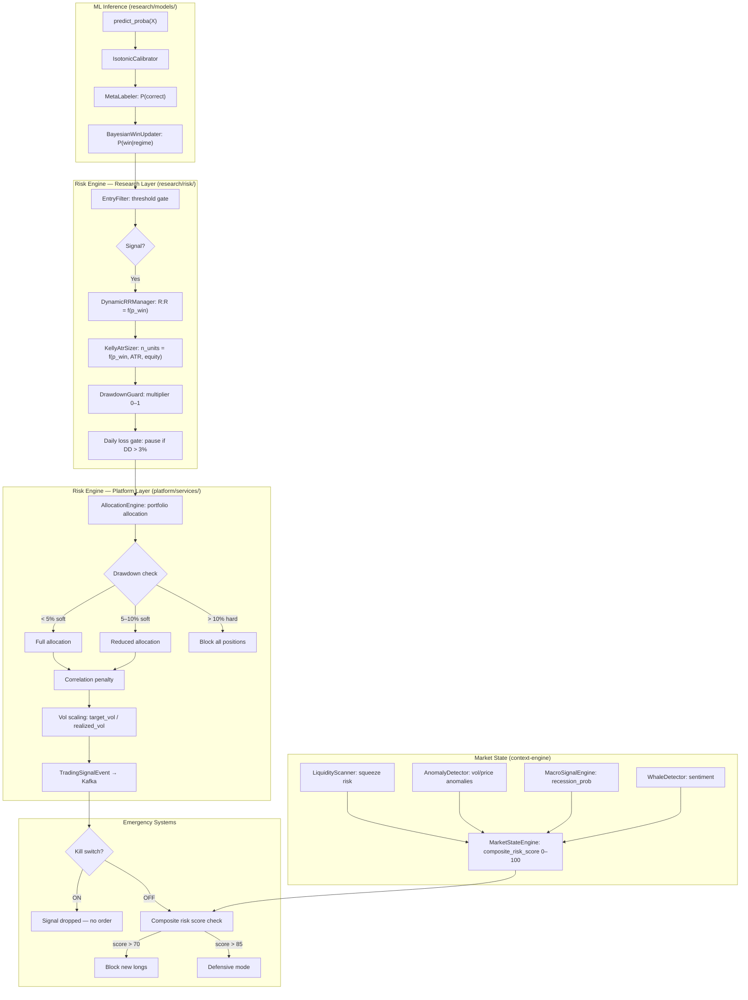
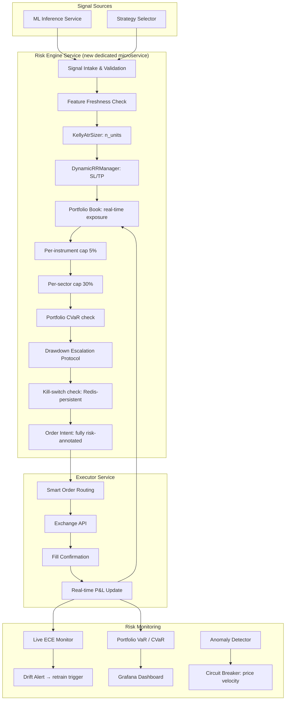

# RISK ENGINE — Institutional Architecture Audit
## `quant_bot` / PROJECT ML

> **Document type**: Technical master reference — Risk architecture audit,
> capital protection systems, operational vulnerabilities, and institutional
> upgrade roadmap.
>
> **Based exclusively on**: Repository source code at `c:\Users\alexj\OneDrive\Desktop\quant_bot\`
> as of 2026-05-14. No invented components. Systems marked **⚠ Pending validation**
> where implementation is ambiguous.
>
> **Last updated**: 2026-05-14
> **Author**: Principal Quantitative Risk Architect (Claude Sonnet 4.6)

---

## TABLE OF CONTENTS

1. [Risk Engine Overview](#1-risk-engine-overview)
2. [Core Risk Architecture](#2-core-risk-architecture)
3. [Position Sizing System](#3-position-sizing-system)
4. [Stop Loss and Exit Systems](#4-stop-loss-and-exit-systems)
5. [Drawdown Protection](#5-drawdown-protection)
6. [Portfolio Risk Management](#6-portfolio-risk-management)
7. [Market Risk Analysis](#7-market-risk-analysis)
8. [Simulation and Backtesting Risk](#8-simulation-and-backtesting-risk)
9. [Risk Metrics and Analytics](#9-risk-metrics-and-analytics)
10. [Operational and Infrastructure Risk](#10-operational-and-infrastructure-risk)
11. [AI and Adaptive Risk Systems](#11-ai-and-adaptive-risk-systems)
12. [Technical Debt and Risk Weaknesses](#12-technical-debt-and-risk-weaknesses)
13. [Institutional Upgrade Roadmap](#13-institutional-upgrade-roadmap)

---

## 1. RISK ENGINE OVERVIEW

### 1.1 Purpose

The risk engine is the capital preservation backbone of `quant_bot`. It operates
across two layers:

| Layer | Location | Status |
|-------|----------|--------|
| **Research / Backtesting** | `research/risk/` | Production-ready logic, not yet wired to live execution |
| **Platform / Runtime** | `platform/services/strategy-orchestrator/` | Partial — kill-switch, drawdown gate, configuration |

Its responsibilities are:
- Translating model probabilities (`P(win)`) into safe position sizes.
- Enforcing stop losses and take-profit targets derived from ATR.
- Gating signal emission when portfolio risk thresholds are exceeded.
- Providing an emergency stop (kill-switch) reachable via REST API.

### 1.2 Role inside the Trading System

```
ML Model P(win)  →  KellyAtrSizer / AllocationEngine  →  Risk gates
                                                              ↓
                                                    DrawdownGuard + kill-switch
                                                              ↓
                                                    TradingSignalEvent (Kafka)
                                                              ↓
                                               executor (⚠ not yet implemented)
```

Risk sits between model output and order emission. It is **not** an afterthought
appended to signal generation — it is an integrated modifier of both signal
intensity (`p_win`) and position size (`n_units`).

### 1.3 Capital Preservation Philosophy

The codebase declares an explicit doctrine:

> *"Tu primer trabajo no es ganar, es no quebrar."*
> (`research/risk/management.py`, module docstring)

Operationally this translates to three priorities, in order:
1. Never exceed daily loss limit (3% default).
2. Never exceed account drawdown limit (10% soft, 20% hard).
3. Never bet more than fractional Kelly recommends.

### 1.4 Risk Management Objectives

| Objective | Implementation | Status |
|-----------|---------------|--------|
| Per-trade risk cap ≤ 2% equity | `KellyAtrSizer.max_risk_pct = 0.02` | ✅ Production |
| Quarter Kelly by default | `kelly_fraction = 0.25` | ✅ Production |
| Daily loss pause @ 3% | `ATRRiskSizer.daily_loss_pct_pause = 0.03` | ✅ Production |
| Drawdown soft brake @ 10% | `AllocationEngine.dd_soft_brake = 0.05–0.10` | ✅ Production |
| Drawdown hard brake @ 20% | `DrawdownGuard.hard_dd_threshold = 0.20` | ✅ Production |
| Portfolio correlation cap | `AllocationEngine._apply_correlation_penalty` | ✅ Production |
| Kill switch (manual + auto) | `strategy-orchestrator /kill-switch/:state` | ✅ Production |
| Portfolio-level exposure caps | Not implemented | ❌ Missing |
| Per-sector exposure caps | Not implemented | ❌ Missing |
| Consecutive loss protection | Not implemented | ❌ Missing |

### 1.5 Current Maturity Level

**Intermediate — transitioning toward Professional.**

The mathematical primitives (Kelly, ATR sizing, dynamic R:R, drawdown guard)
are well-implemented and defensible. The operational layer (runtime enforcement,
reconciliation, live execution) is nascent and not yet verified in live trading.

---

## 2. CORE RISK ARCHITECTURE

### 2.1 System Diagram



### 2.2 Risk Hierarchy

The system enforces risk decisions in this priority order (highest to lowest):

| Priority | Gate | Enforcer | Effect |
|----------|------|----------|--------|
| 1 | Manual kill-switch | `strategy-orchestrator` REST API | All signals dropped |
| 2 | Composite risk score > 85 | `MarketStateEngine` | Defensive mode: no new longs |
| 3 | Composite risk score > 70 | `MarketStateEngine` | No new long positions |
| 4 | Drawdown hard brake > 10% | `AllocationEngine` | 0 allocation to all strategies |
| 5 | Daily loss > 3% | `KellyAtrSizer` / `ATRRiskSizer` | 0 units for current session |
| 6 | Kelly f* ≤ 0 | `kelly_fraction_binary` | No position (EV negative) |
| 7 | Position below min_risk_pct | `KellyAtrSizer` | Skip (too small to be meaningful) |
| 8 | Drawdown soft brake 5–10% | `AllocationEngine` | Proportional reduction |
| 9 | Max risk per trade cap | `KellyAtrSizer.max_risk_pct = 0.02` | Size capped at 2% equity |
| 10 | Correlation penalty | `AllocationEngine` | Reduce correlated pair |

### 2.3 Signal-to-Risk Flow (Platform)

```
Kafka: los_ojos.ml.feature_vector
    ↓
_generate_signal()  [strategy-orchestrator/app/main.py]
    → p_win from features (bayesian > ml > 0.5 fallback)
    → composite score = (p_win - 0.5)×2 + whale×0.2 + ob_imbalance×0.1 - recession×0.3
    → threshold: score > 0.3 AND p_win > 0.58 → LONG
    → drawdown gate check (_pnl_cache["drawdown"] > max_drawdown)
    ↓
position_size = config.risk_per_trade (flat, not Kelly-dynamic yet)
    ↓
Kafka: los_ojos.signals.trading
```

**Critical gap**: the platform's `_generate_signal()` uses a flat
`risk_per_trade` (default 2%), bypassing the sophisticated `KellyAtrSizer` and
`DynamicRRManager` logic implemented in `research/risk/`. The Kelly + ATR
machinery exists but is not connected to the live signal emission path.

### 2.4 Emergency Shutdown

```python
# platform/services/strategy-orchestrator/app/main.py
_kill_switch: bool = False  # module-level state

@app.post("/kill-switch/{state}", tags=["bot"])
async def toggle_kill_switch(state: str):
    _kill_switch = (state == "on")   # ← affects _orchestrate_loop()
```

**Effect**: when `_kill_switch = True`, the orchestration loop receives Kafka
messages but `continue`s without processing them. No orders are emitted.

**Weakness**: the kill-switch state is in-process memory only. If the service
restarts, it resets to `False`. There is no persistent kill-switch flag in
Redis or Postgres.

---

## 3. POSITION SIZING SYSTEM

### 3.1 Implemented Sizers

#### 3.1.1 `FixedUnitsSizer` — `research/risk/sizing_multi_asset.py`
**Classification: Legacy / Testing**

```python
@dataclass
class FixedUnitsSizer:
    n_units: float = 1.0
```

- **Logic**: constant units regardless of equity, volatility, or signal confidence.
- **Weakness**: no risk adjustment. $10K account and $10M account get identical position.
- **Use case**: testing, debugging only.
- **Scalability**: None.

#### 3.1.2 `ATRRiskSizer` — `research/risk/sizing_multi_asset.py`
**Classification: Production (Research)**

```
risk_usd      = equity × risk_pct
stop_distance = atr_stop_mult × ATR
n_units       = risk_usd / (stop_distance × usd_per_unit × fx_factor)
```

| Parameter | Default | Role |
|-----------|---------|------|
| `risk_pct` | 0.5% | Fixed fraction of equity per trade |
| `atr_stop_mult` | 2.0× | Stop width in ATR units |
| `daily_loss_pct_pause` | 3% | Daily session kill switch |
| `max_units_per_trade` | None | Optional absolute unit cap |

- **Logic**: converts a fixed equity fraction into physical units via ATR stop.
- **Weakness**: `risk_pct` is static — does not adapt to model confidence.
- **Scalability**: works well up to mid-frequency. At high notional it needs slippage correction.

#### 3.1.3 `KellyAtrSizer` — `research/risk/kelly.py`
**Classification: Production (Research)**

Combines Kelly fractional with ATR stop:

```
f* = p_win − (1 − p_win) / rr_ratio    [Kelly full]
f_kelly = kelly_fraction × f*            [Quarter Kelly]
f_applied = min(f_kelly, max_risk_pct)  [Cap at 2%]

risk_usd = equity × f_applied
n_units  = risk_usd / (atr_sl_mult × ATR × usd_per_unit × fx_factor)
```

| Parameter | Default | Role |
|-----------|---------|------|
| `kelly_fraction` | 0.25 | Fractional Kelly (quarter) |
| `max_risk_pct` | 2% | Hard cap per trade |
| `min_risk_pct` | 0.1% | Skip below this (no symbolic positions) |
| `atr_sl_mult` | 2.0× | Stop width |
| `atr_tp_mult` | 3.0× | Computes R:R = tp/sl = 1.5 by default |
| `daily_loss_pct_pause` | 3% | Same session gate as ATRRiskSizer |

- **Logic**: fully probability-aware; position scales with model confidence.
- **Weakness**:
  - `rr_ratio` is static unless `update_rr_from_history()` is called explicitly (not automated).
  - No multi-asset correlation awareness at the sizer level.
  - The `InstrumentSpec` object is required but not validated against live market data.
- **Scalability**: robust for multi-instrument with per-instrument `InstrumentSpec`. Needs slippage correction at scale.

#### 3.1.4 `vol_target_size` — `research/risk/management.py`
**Classification: Production (Research)**

```
weight = target_vol / asset_volatility
position_usd = equity × min(weight, leverage_cap)
```

- **Logic**: portfolio volatility targeting; scales down in high vol, up in low vol.
- **Default**: 15% annualized target vol.
- **Weakness**: leverage_cap defaults to 1.0 (no leverage), not enforced dynamically.

#### 3.1.5 `IntegratedRiskManager` — `research/risk/management.py`
**Classification: Production (Research)**

Combines vol targeting + DrawdownGuard into a single callable:

```python
weight = target_vol / annualized_vol
dd_mult = DrawdownGuard.update(equity)
final = weight × dd_mult × |signal| × sign(signal)
```

- **Hardcoded assumption**: uses `sqrt(8760)` annualization factor (hourly bars). This
  breaks silently for other timeframes.

#### 3.1.6 Platform `risk_per_trade` — `strategy-orchestrator/app/main.py`
**Classification: Experimental / Incomplete**

```python
"position_size": _current_config.risk_per_trade  # default 0.02 (flat 2%)
```

- **Logic**: a flat percentage. No Kelly, no ATR, no vol adjustment.
- **Status**: placeholder — the rich sizing logic from `research/risk/` has not been integrated.
- **Severity**: **Critical gap** for live trading.

### 3.2 Leverage Management

| Constraint | Location | Value | Status |
|------------|----------|-------|--------|
| `max_leverage` env var | `strategy-orchestrator` | 2.0× | ✅ |
| `AllocationEngine.max_leverage` | `allocation_engine.py` | 2.0× | ✅ |
| `vol_target_size` leverage_cap | `management.py` | 1.0× | ⚠ Static |
| Per-instrument leverage | Not implemented | — | ❌ |
| Margin exposure tracking | Not implemented | — | ❌ |

---

## 4. STOP LOSS AND EXIT SYSTEMS

### 4.1 `StopManager` — `research/risk/management.py`
**Classification: Production (Research)**

```python
@dataclass
class StopLoss:
    initial_atr_mult: float = 2.0     # 2× ATR stop
    trailing: bool = True             # trailing stop enabled
    take_profit_atr_mult: float = 4.0 # 4× ATR TP (R:R = 2:1)
```

**Trailing stop logic**:
- Long: stop moves up when price rises (`new_stop > current_stop`).
- Short: stop moves down when price falls (`new_stop < current_stop`).
- Stop never moves against the trade direction.

**Exit check**:
```python
def check_exit(self, high, low) -> Optional[str]:
    if direction == 1:
        if low <= stop_price: return 'stop'
        if high >= tp_price:  return 'tp'
```

- **Robustness**: standard ATR-based trailing. Handles both directions. Uses bar high/low for exit detection (conservative — no intrabar fill estimation).
- **Latency sensitivity**: the check is per-bar. In live trading, sub-bar moves can trigger the stop before `update()` is called. Execution latency is not modeled.
- **Slippage exposure**: no slippage applied to stop/TP fill price. In volatile markets, actual fill will be worse than `stop_price`.
- **Failure scenario**: if ATR spikes during a news event (e.g., 3× normal), the stop distance at entry becomes too wide. The position survives the spike but may be held through a large adverse move before TP or trailing catches it.

### 4.2 `DynamicRRManager` — `research/risk/dynamic_rr.py`
**Classification: Production (Research)**

Maps `P(win)` → R:R → TP distance:

```
SL_distance = atr_sl_mult × ATR          (fixed structural stop)
R:R         = f(P(win), rr_min, rr_max)  (dynamic: 1.2 – 2.5)
TP_distance = R:R × SL_distance
```

| Mapping Shape | Behavior | Recommended Use |
|---------------|----------|-----------------|
| `linear` | Linear interpolation between `p_low` and `p_high` | Diagnostics |
| `sigmoid` | Smooth S-curve, plateau at extremes | **Production** |
| `stepped` | 3 discrete levels | Ops monitoring |

**Default parameters** (sigmoid):
- `rr_min = 1.2`, `rr_max = 2.5`
- `p_low = 0.45`, `p_high = 0.75`

- **Robustness**: sigmoid preferred — prevents large TP jumps from small probability changes.
- **Weakness**: `rr_min` and `rr_max` are config parameters, not calibrated from actual historical trade outcomes. They should be derived from `estimate_rr_ratio()`.
- **Platform integration**: not connected to the platform's `_generate_signal()`. Stop and TP levels are never computed for live signals.

### 4.3 Exit System Completeness

| Exit Type | Research Layer | Platform Layer |
|-----------|---------------|----------------|
| Hard ATR stop | ✅ `StopManager` | ❌ Not implemented |
| Trailing stop | ✅ `StopManager` | ❌ Not implemented |
| ATR take-profit | ✅ `DynamicRRManager` | ❌ Not implemented |
| Dynamic TP (confidence-scaled) | ✅ `DynamicRRManager` | ❌ Not implemented |
| Time-based exit | ❌ Not implemented | ❌ Not implemented |
| Volatility protection (widen stop) | ❌ Not implemented | ❌ Not implemented |
| Emergency liquidation | ⚠ Kill-switch only | ⚠ Kill-switch only |

**Critical gap**: the platform does not compute or enforce stop/TP levels at all. All
exit logic lives exclusively in the research backtesting layer.

---

## 5. DRAWDOWN PROTECTION

### 5.1 Research Layer: `DrawdownGuard`
**`research/risk/management.py` — Classification: Production (Research)**

```python
@dataclass
class DrawdownGuard:
    soft_dd_threshold: float = 0.10   # 10% DD: sizing × 0.5
    soft_dd_multiplier: float = 0.5
    hard_dd_threshold: float = 0.20   # 20% DD: full pause

def update(self, current_equity: float) -> float:
    # Returns: multiplier in [0, 1]
    drawdown = (current_equity - peak) / peak
    if drawdown ≤ -hard_dd_threshold: return 0.0
    if paused and not recovered: return 0.0
    if drawdown ≤ -soft_dd_threshold: return 0.5
    return 1.0
```

**Recovery logic**: after hard pause, resumes only when equity recovers to ≥ 99%
of peak — equivalent to requiring a new equity high before re-entering.

### 5.2 Platform Layer: `AllocationEngine`
**`platform/services/strategy-orchestrator/app/allocation_engine.py`**

```python
dd_soft_brake: float = 0.05   # 5% DD → start reducing
dd_hard_brake: float = 0.10   # 10% DD → 0 allocation

def _drawdown_multiplier(self, dd: float) -> float:
    # Linear ramp from 1.0 at dd_soft_brake to 0.0 at dd_hard_brake
```

More aggressive than `DrawdownGuard` (triggers at 5% vs 10%). **This is the active
runtime protection for the platform.**

### 5.3 Drawdown Gate in Signal Generator

```python
# strategy-orchestrator/app/main.py
if _pnl_cache.get("drawdown", 0) > (config.max_drawdown):
    return None  # block signal
```

**Default `max_drawdown`**: 10% (configurable per `BotConfig`).

### 5.4 Drawdown Assessment

| Protection | Trigger | Effect | Status | Realism |
|------------|---------|--------|--------|---------|
| Research `DrawdownGuard` soft | 10% DD | Size × 0.5 | ✅ Production (backtest) | ✅ Realistic |
| Research `DrawdownGuard` hard | 20% DD | Full pause | ✅ Production (backtest) | ✅ Realistic |
| Platform `AllocationEngine` soft | 5% DD | Linear reduction to 0 | ✅ Production | ✅ Realistic |
| Platform `AllocationEngine` hard | 10% DD | Zero allocation | ✅ Production | ✅ Realistic |
| Signal gate | Config `max_drawdown` (default 10%) | Block signal | ✅ Production | ⚠ Depends on `_pnl_cache` accuracy |
| Daily loss session pause | 3% per day | Zero sizing | ✅ Production (backtest) | ✅ Realistic |
| Consecutive loss protection | Not implemented | — | ❌ Missing | — |
| Equity curve protection | Not implemented | — | ❌ Missing | — |

### 5.5 Failure Analysis

**Can protections fail under stress?**

1. **`_pnl_cache["drawdown"]` accuracy**: this dictionary is populated by the
   orchestration loop. If `_pnl_cache` is stale or not updated (e.g., Kafka consumer
   lag), the drawdown gate sees `0` and never blocks. **Risk level: Critical.**

2. **No consecutive loss counter**: a sequence of 10 small losses below the 3%
   daily threshold, each below 1%, accumulates 10% loss without triggering any
   explicit protection.

3. **Recovery threshold**: `DrawdownGuard` resumes at 99% of peak. In a prolonged
   drawdown, the equity may oscillate below the peak for months, perpetually pausing
   and unpausing at the 99% level — a de facto trading halt without an explicit alert.

4. **Asymmetric thresholds**: the platform uses 10% hard brake; `DrawdownGuard`
   uses 20%. These are inconsistent. In a live system, the platform gates block
   first, but the research backtesting models more permissive thresholds — creating
   a backtest that is more optimistic than live trading.

---

## 6. PORTFOLIO RISK MANAGEMENT

### 6.1 Correlation Control
**`platform/services/strategy-orchestrator/app/allocation_engine.py`**

```python
corr_threshold: float = 0.70   # treat as same position above this

def _apply_correlation_penalty(self, norm, correlations):
    # For pairs with corr > threshold:
    # penalty = (corr - threshold) / (1 - threshold)
    # Apply penalty to the smaller allocation of the pair
```

- **Logic**: partial reduction proportional to excess correlation.
- **Weakness**: correlations are passed in as a `dict[str, float]` argument —
  they must be computed externally and provided at each allocation cycle.
  No automated correlation computation exists in the codebase.
  **The correlation penalty is architecturally correct but operationally hollow
  without a live correlation feed.**

### 6.2 Allocation Caps

| Constraint | Value | Source |
|------------|-------|--------|
| Max single strategy | 40% of capital | `AllocationConfig.max_single_alloc` |
| Min single strategy | 5% (below = skip) | `AllocationConfig.min_single_alloc` |
| Max total leverage | 2× | `AllocationConfig.max_leverage` |
| Kelly fraction applied | 0.25 | `AllocationConfig.kelly_fraction` |
| Vol target | 15% annualized | `AllocationConfig.target_vol` |

### 6.3 Multi-Strategy Interaction

```python
# strategy-orchestrator/app/main.py
active_strategies: ["momentum_ml", "mean_reversion_funding"]
```

The `StrategySelector` (`strategy_selector.py`) uses Thompson Sampling (Beta
distribution per strategy) to allocate capital fractions. These fractions are
then passed to `AllocationEngine`. This creates a **bandit-style allocator** that
exploits recent performance but can concentrate capital on one strategy after a
lucky streak.

### 6.4 Portfolio Risk Gaps

| Risk Dimension | Implementation | Status |
|----------------|---------------|--------|
| Per-instrument cap (5% equity) | Not implemented | ❌ Missing |
| Per-sector cap (30% altcoins) | Not implemented | ❌ Missing |
| Exchange concentration risk | Not implemented | ❌ Missing |
| Stablecoin dependency tracking | Not implemented | ❌ Missing |
| Cross-asset correlation matrix | Not implemented (external feed assumed) | ❌ Missing |
| Portfolio VaR / CVaR live | Not implemented | ❌ Missing |
| Cascading liquidation detection | Not implemented | ❌ Missing |

**Hidden systemic risk**: if `momentum_ml` and `mean_reversion_funding` are
correlated in a crisis (both long BTC), the correlation penalty assumes
decorrelation data is provided. Without it, both strategies may be fully
allocated simultaneously.

---

## 7. MARKET RISK ANALYSIS

| Risk Type | Exposure | Classification | Existing Protection |
|-----------|----------|---------------|---------------------|
| **Volatility spikes** | High — crypto is 3–5× stock vol | **Critical** | ATR-based stop widens naturally; `squeeze_risk` in MarketState |
| **Liquidity crises** | Medium — concentrated in BTC/ETH | **High** | LiquidityScanner OI + liquidation z-scores |
| **Flash crashes** | High — 10–30% BTC drops in minutes | **Critical** | Kill-switch (manual); no auto-trigger on price velocity |
| **Slippage** | Medium — estimated but not enforced | **High** | Backtester models slippage (bps + vol) but not enforced in live |
| **Low-volume conditions** | Medium | **Medium** | No volume floor check before signal emission |
| **Exchange outages** | High — single exchange dependency | **Critical** | No circuit breaker; WebSocket reconnect only |
| **Funding rate instability** | Medium — perpetuals only | **Medium** | FundingMonitor tracks; `funding_z` in MarketState |
| **Manipulation / wash trading** | High in altcoins | **High** | No detection; order book imbalance is a partial proxy |
| **News-driven volatility** | High — macro events (FOMC, CPI) | **High** | MacroSignalEngine tracks FRED; no real-time news integration |
| **MEV / front-running** | Low — CEX execution only | **Low** | Not applicable for current exchange model |
| **Correlated multi-asset crash** | High — crypto correlation → 1 in crisis | **Critical** | Partial: correlation penalty, but no systemic stress test |
| **Counterparty risk (exchange)** | High — 100% exposure to Binance | **High** | No multi-venue execution |

### 7.1 Flash Crash Gap

The most dangerous unprotected scenario is a flash crash (BTC −20% in 5 minutes).
The kill-switch is manual-only. The `DrawdownGuard` would trigger at 20% but by
then the loss is already realized. The `composite_risk_score` would only reach
"defensive mode" after the `AnomalyDetector` processes the anomaly — which
consumes Kafka messages with inherent latency.

**Recommendation**: implement a price-velocity circuit breaker (e.g., if
`|Δclose / ATR| > 3` in a single bar, suspend all new orders immediately).

---

## 8. SIMULATION AND BACKTESTING RISK

### 8.1 `Backtester` — `research/backtesting/engine.py`

**Signal execution**: signals generated at bar `t` execute at `open[t+1]`.
This correctly avoids look-ahead bias on close prices.

**Slippage model**:
```python
slippage = slippage_bps + slippage_vol_mult × recent_vol
```
Applied as a BPS cost on position changes. `recent_vol` is a 20-bar rolling
std of log returns.

**Fee model**: single fee per position change (entry and exit). No maker/taker
differentiation.

### 8.2 Simulation Quality Assessment

| Risk | Status | Severity |
|------|--------|----------|
| **Overfitting** | Walk-forward validation (`WalkForwardRunner`) is mandatory. DSR corrects for multiple testing. | ✅ Mitigated |
| **Data leakage** | Anti-leakage by contract: transformers fit only on training data. `WalkForwardSplitter` enforces temporal embargo. | ✅ Mitigated |
| **Survivorship bias** | No explicit control. CCXT + yfinance provide live instruments — delisted coins absent. | ⚠ Partial risk |
| **Unrealistic assumptions** | Position sizer in backtester uses `equity = 1.0` (normalized), not real equity tracking in the loop | ⚠ Moderate |
| **Slippage realism** | Volume-adjusted slippage is modeled, but no orderbook depth modeling. Large orders assumed fillable. | ⚠ Moderate |
| **Spread realism** | Fees applied but bid-ask spread not modeled separately. Mid-price execution assumed. | ⚠ Moderate |
| **Latency simulation** | Signal delay is 1 bar. No sub-bar latency or partial fills. | ⚠ Moderate |
| **Forward testing consistency** | Walk-forward OOS concatenation approximates forward testing. No paper trading bridge yet. | ⚠ Partial |
| **Leverage in backtest** | `allow_short` flag; position sizing fraction not enforced to sum ≤ 100% across assets. | ⚠ Moderate |

### 8.3 Hardcoded Annualization Bug

`IntegratedRiskManager` hardcodes hourly bars:
```python
annualized_vol = recent_vol * np.sqrt(8760)  # assumes hourly
```
If the backtester runs on 1m or 4h bars, vol will be incorrect, causing
systematic mis-sizing throughout the entire simulation run. **Severity: Severe.**

### 8.4 Credibility Assessment

| Dimension | Score | Verdict |
|-----------|-------|---------|
| Temporal integrity | 9/10 | Walk-forward + embargo excellent |
| Fee modeling | 6/10 | Missing maker/taker, funding rates |
| Slippage modeling | 5/10 | Proportional model, no depth |
| Multi-asset portfolio backtesting | 3/10 | Single-asset Backtester, no portfolio |
| Overfitting control | 8/10 | DSR + ablative analysis strong |
| Overall institutional credibility | **5/10** | Good research tool; not production-grade |

### 8.5 Simulations to Discard

| Simulation Type | Reason |
|-----------------|--------|
| Any IS-only (in-sample) result | Not reported by design (walk-forward mandatory) |
| Simulations with `FixedUnitsSizer` | No risk-adjusted meaning |
| Any backtest using archived `research/archive/session*.py` scripts | Fragile sys.path dependencies, unreproducible |
| Backtests on timeframes other than 1h without changing annualization factor | Vol computation is wrong |

---

## 9. RISK METRICS AND ANALYTICS

### 9.1 Implemented Metrics

#### In `research/backtesting/engine.py`

| Metric | Status | Quality |
|--------|--------|---------|
| Sharpe Ratio (annualized) | ✅ Implemented | Standard; uses `rf=0.04` by default |
| Sortino Ratio | ✅ Implemented | Correct downside std formula |
| Calmar Ratio | ✅ Implemented | CAGR / |MaxDD| |
| Max Drawdown | ✅ Implemented | Returns (value, peak_date, trough_date) |
| CAGR | ✅ Implemented | Correct time-based calculation |
| Win Rate | ✅ Implemented | Per-trade |
| Profit Factor | ✅ Implemented | Gross profit / gross loss |
| Avg trade return | ✅ Implemented | |
| Avg win / Avg loss ratio | ✅ Implemented | |
| Volatility (annualized) | ✅ Implemented | |

#### In `research/metrics/advanced.py`

| Metric | Status | Quality |
|--------|--------|---------|
| PSR (Probabilistic Sharpe Ratio) | ✅ Implemented | Bailey & LdP formula; per-period SR |
| DSR (Deflated Sharpe Ratio) | ✅ Implemented | Multiple testing correction; Euler-Mascheroni |
| Sharpe SE (Mertens 2002) | ✅ Implemented | Adjusts for skew and kurtosis |
| Bootstrap Sharpe CI | ✅ Implemented | 2000 bootstrap samples, configurable |
| VaR (5%) | ✅ Implemented | Historical, correct |
| CVaR / Expected Shortfall (5%) | ✅ Implemented | Mean of tail below VaR |
| Tail Ratio | ✅ Implemented | Right tail / left tail ratio |
| Skewness | ✅ Implemented | With kurtosis convention note (RAW vs excess) |
| Kurtosis (raw and excess) | ✅ Implemented | Explicit convention documented |
| IS/OOS degradation | ✅ Implemented | `is_oos_degradation()` with haircut |
| Cost drag (gross vs net Sharpe) | ✅ Implemented | |
| Turnover | ✅ Implemented | |

### 9.2 Missing Metrics

| Metric | Status | Importance |
|--------|--------|-----------|
| **VaR (parametric, Monte Carlo)** | ❌ Historical only | Medium |
| **Recovery Factor** | ❌ Not implemented | High |
| **Expectancy** (per dollar at risk) | ❌ Not implemented | High |
| **Exposure Time** (% bars in position) | ❌ Not implemented | Medium |
| **Risk/Reward per trade** (distribution) | ❌ Not implemented | High |
| **Portfolio VaR** (multi-asset) | ❌ Not implemented | Critical |
| **Portfolio CVaR** | ❌ Not implemented | Critical |
| **Maximum Consecutive Losses** | ❌ Not implemented | High |
| **Ulcer Index** | ❌ Not implemented | Medium |
| **Lake Ratio** | ❌ Not implemented | Low |
| **Live ECE** (calibration error monitoring) | ❌ Not implemented | High |

### 9.3 Metric Quality Notes

**VaR**: the historical implementation is correct but conservative for small
samples. Parametric VaR (assuming normal distribution) would be faster but less
appropriate for fat-tailed crypto returns. A **filtered historical simulation**
with GARCH vol scaling would be the appropriate institutional upgrade.

**DSR**: the implementation requires honest `n_trials` input. The codebase
correctly warns about this, but there is no automated tracking of the actual
number of hyperparameter combinations tried across Optuna runs.

**ECE**: computed at training time via `IsotonicCalibrator`. No runtime ECE
monitoring exists — model calibration can degrade silently after deployment.

---

## 10. OPERATIONAL AND INFRASTRUCTURE RISK

### 10.1 API Dependency Risks

| Dependency | Risk | Existing Protection | Gap |
|------------|------|---------------------|-----|
| Binance REST (OHLCV, funding) | **High** — single venue | CCXT retry logic | No fallback venue |
| Binance WebSocket | **High** — flash crashes hit WS first | WebSocket reconnect logic | No data freshness check at consumer |
| Crucix API (on-chain) | **High** — proprietary, paid | ⚠ None visible | No fallback; silent failure likely |
| FRED API (macro) | **Medium** — daily data | FRED rate limits handled | None |
| aiokafka consumer | **High** — all streaming depends on it | `try/finally` consumer.stop() | No DLQ for failed messages |

### 10.2 WebSocket Failures

```python
# realtime-signal/app/main.py — reconnect logic (from prior analysis)
# Uses exponential backoff with reconnection
```

The `market-intelligence` Binance WebSocket has reconnect logic. However:
- No maximum reconnect attempt limit — could loop indefinitely.
- Reconnection does not check for data continuity (gaps in OHLCV not detected).
- The `feature-streaming` service reads from Redis with no staleness check; stale
  features can persist beyond their TTL window if keys are not expired promptly.

### 10.3 Data Corruption Risks

- **NaN propagation**: feature vectors with NaN values are not explicitly validated
  at signal generation. The `KellyAtrSizer` checks `pd.isna(current_atr)` but the
  platform `_generate_signal()` performs no validation on `feats`.
- **Redis key mismatch** (identified in `ONCHAIN.md`): `onchain-analysis` writes
  to `onchain:flow:*` but `feature-streaming` reads from `onchain:whale_sentiment:*`.
  This is a data corruption risk — consumers see zero/stale values silently.

### 10.4 Synchronization and Clock Drift

- All events use Python `datetime.now(timezone.utc)` — no NTP synchronization
  enforcement.
- Kafka consumer `auto_offset_reset="latest"` means events during service
  downtime are dropped, not replayed. For risk-critical services this is a gap.
- No global clock drift monitoring exists.

### 10.5 Infrastructure Downtime

| Component | Single Point of Failure | Mitigation |
|-----------|------------------------|------------|
| `strategy-orchestrator` | Yes — kill-switch state is in-memory | ❌ None (state lost on restart) |
| `context-engine` | Yes — composite risk score | ⚠ Redis cache (60s TTL) |
| Kafka broker | Yes — single broker in local config | ❌ No replication in dev |
| Redis | Yes — all feature state | ❌ No Sentinel in dev |
| Postgres | Yes — wallet labels, bot config | ❌ No replication in dev |

### 10.6 Memory Leaks and Concurrency

- `_latest_anomalies` in `context-engine/app/main.py` is a list with no max-size
  enforcement. Under sustained anomaly detection, it can grow unboundedly.
  (Last 50 are kept: `_latest_anomalies[:20]`, but the list is appended without truncation.)
- `_active_positions` in `strategy-orchestrator` is a global list with no cleanup mechanism.
- Python asyncio tasks are collected in `_bg_tasks` but cancellation on shutdown
  uses `return_exceptions=True` — exceptions during shutdown are silently swallowed.

---

## 11. AI AND ADAPTIVE RISK SYSTEMS

### 11.1 Existing AI Risk Components

#### 11.1.1 Bayesian Sizing — `research/risk/bayesian_sizer.py`
**Classification: Production (Research)**

`BayesianWinUpdater` adjusts model probabilities using regime-conditioned priors:
```
odds_post = odds_prior × odds_model   [Product of Experts]
p_post    = odds_post / (1 + odds_post)
```

- **Risk**: the prior table `_prior_table[(regime, direction)]` is estimated from
  calibration data. If regime labels shift (GMM component reordering after refit),
  the prior table becomes misaligned. No consistency check exists.
- **Self-reinforcing failure**: if a bad prior overrides a good model, the system
  trades less in regimes where the prior underestimates win rate. The prior is
  updated only on explicit `fit()` calls — not continuously.

#### 11.1.2 Q-Learning Agent — `research/models/rl_agent.py`
**Classification: Experimental**

Tabular Q-learning with state space `(regime_bin, p_win_bin, trend_bin)`:
- 36 total states (3 regimes × 4 p_win bins × 3 trend bins)
- Actions: `{-1, 0, +1}`
- Reward: bar return × `sign(action) - transaction_cost`

**AI risk assessment**:

| Risk | Severity | Note |
|------|----------|------|
| Non-stationarity of Q-table | **Severe** | Market regimes shift; Q-values become stale |
| Epsilon-greedy exploration in production | **Critical** | `epsilon` must be 0 in live trading. This is enforced via `agent.act()` using greedy selection, but `epsilon_min` defaults to 0.05 — residual exploration. |
| State space mismatch | **Moderate** | If GMM is refit with more components, the `n_regimes` dimension changes. Q-table is incompatible. |
| No risk limits from RL | **Correct** | The agent selects direction only; sizing is delegated to the Kelly sizer. RL does not decide risk limits (ADR-009 compliant). |
| Self-reinforcing failure | **Moderate** | If the agent learns to always be long during a bull run, it has no memory when regime shifts. The regime bin is supposed to prevent this, but the discretization is coarse. |
| Model drift detection | **Missing** | No monitoring of whether Q-table performance degrades over time |
| Black-box vulnerability | **Low** | Tabular Q is fully interpretable — every state-action value is inspectable |

#### 11.1.3 Meta-Labeler — `research/models/meta_labeler.py`
**Classification: Production (Research)**

A second binary classifier that predicts whether the primary signal will be correct.
This is an adaptive risk layer — it can suppress an otherwise valid signal if
the meta-labeler's confidence `P(correct)` is below `META_THRESHOLD`.

**Risk**: the meta-labeler is trained on primary model errors. If the primary model
improves (e.g., after retraining), the meta-labeler's training distribution becomes
misaligned. This requires synchronized retraining of both models.

### 11.2 Missing AI Risk Systems

For future institutional implementation:

| System | Purpose | Priority |
|--------|---------|----------|
| **Regime-conditioned VaR** | VaR that scales with current GMM regime | High |
| **Online drift detection** | PSI + KS test on feature distributions, auto-retrain trigger | High |
| **Adaptive Kelly** | Kelly fraction that shrinks when calibration ECE degrades | High |
| **Reinforcement learning risk guard** | External RL agent that learns optimal drawdown response | Medium |
| **Model ensemble disagreement** | When models disagree, reduce position size proportionally | Medium |
| **Adversarial input detection** | Flag feature vectors that are out-of-distribution (OOD) | Low |

---

## 12. TECHNICAL DEBT AND RISK WEAKNESSES

### 12.1 Critical

| ID | Issue | Location | Description |
|----|-------|----------|-------------|
| TD-C1 | **Kelly not wired to platform** | `strategy-orchestrator/app/main.py:200` | `position_size = config.risk_per_trade` (flat). `KellyAtrSizer` exists but is not used in live signal generation. |
| TD-C2 | **Stop/TP levels not computed in platform** | `strategy-orchestrator` | No `sl_price` or `tp_price` in `TradingSignalEvent`. Executor (not yet built) has no exit targets. |
| TD-C3 | **Kill-switch state is ephemeral** | `strategy-orchestrator/app/main.py:61` | `_kill_switch: bool = False` resets on restart. A hard kill meant to last hours is erased by a pod restart. |
| TD-C4 | **`_pnl_cache["drawdown"]` reliability** | `strategy-orchestrator/app/main.py:186` | Drawdown gate depends on `_pnl_cache`, which is populated by `_active_positions`. If fills are not tracked (executor missing), the cache shows 0 drawdown forever. |
| TD-C5 | **Redis key mismatch** | `onchain-analysis` ↔ `feature-streaming` | `whale_sentiment` written to wrong key. Downstream consumers see zero sentiment silently. |

### 12.2 Severe

| ID | Issue | Location | Description |
|----|-------|----------|-------------|
| TD-S1 | **Hardcoded annualization** | `management.py:237` | `sqrt(8760)` assumes hourly bars. Breaks for any other timeframe. |
| TD-S2 | **Memory growth: `_latest_anomalies`** | `context-engine/app/main.py` | List grows unboundedly. `[:20]` slicing for reads does not truncate the list. |
| TD-S3 | **No feature freshness validation** | `strategy-orchestrator` | Feature vectors from Kafka are consumed without checking timestamp freshness. Stale features (minutes old) can generate signals. |
| TD-S4 | **No InstrumentSpec validation** | `KellyAtrSizer` | `usd_per_unit_per_price_point` is user-supplied and not validated against live market data. Wrong value = wrong sizing. |
| TD-S5 | **Inconsistent drawdown thresholds** | Research vs Platform | Research `DrawdownGuard` uses 10/20%; Platform uses 5/10%. Backtests are more permissive than the live system. |

### 12.3 Moderate

| ID | Issue | Location | Description |
|----|-------|----------|-------------|
| TD-M1 | **`_global_prior` fallback in Bayesian updater** | `bayesian_sizer.py` | Cells with < 20 samples fall back to global prior. In early deployment with few trades, all cells use global prior → Bayesian update is ineffective. |
| TD-M2 | **Thompson Sampling concentration risk** | `strategy_selector.py` | After a lucky streak, Thompson Sampling concentrates all capital on one strategy, defeating diversification. No exploration floor enforced at portfolio level. |
| TD-M3 | **`min_edge = 0.0` in Kelly** | `kelly.py:69` | Kelly enters any EV-positive bet, including marginal ones (f* = 0.001). Combined with `min_risk_pct`, most are filtered, but boundary cases exist. |
| TD-M4 | **No slippage in live signals** | `strategy-orchestrator` | Slippage is modeled in backtest but the live signal `position_size` makes no allowance for execution cost. |
| TD-M5 | **`estimate_rr_ratio` not automated** | `kelly.py:122` | Must be called manually. If never called, `rr_ratio = 1.5` static is used forever regardless of actual trade outcomes. |

### 12.4 Minor

| ID | Issue | Location | Description |
|----|-------|----------|-------------|
| TD-m1 | **`BotConfig` defaults not in Postgres** | `strategy-orchestrator` | Config is hardcoded in `lifespan()` instead of loaded from DB. Loss of config customization on restart. |
| TD-m2 | **`_bg_tasks` exception swallowing** | All services | `return_exceptions=True` in gather silently hides shutdown errors. |
| TD-m3 | **No type annotations on InstrumentSpec** | `sizing_multi_asset.py:82` | `instrument: InstrumentSpec = None` allows None initialization but post_init raises ValueError. Should use `Optional` with `field`. |
| TD-m4 | **`p_win` fallback to 0.5** | `strategy-orchestrator:164` | If neither Bayesian nor ML p_win is available, defaults to 0.5 (neutral). This means `score = 0`, which likely results in no signal — acceptable behavior but should be logged explicitly. |

---

## 13. INSTITUTIONAL UPGRADE ROADMAP

### 13.1 Phase 1 — Immediate Fixes (1–2 weeks)

**Priority: Critical stability and correctness.**

| Action | Target | Effort |
|--------|--------|--------|
| **Wire KellyAtrSizer to platform** | Replace flat `risk_per_trade` in `_generate_signal()` with `KellyAtrSizer.__call__()` | Medium |
| **Persist kill-switch to Redis** | Store `_kill_switch` flag in Redis with no TTL; read on startup | Small |
| **Fix Redis key mismatch** | Align `onchain-analysis` write keys with `feature-streaming` read keys | Small |
| **Add feature freshness check** | Reject Kafka messages with `ts` older than 60s in `_generate_signal()` | Small |
| **Compute SL/TP in signal event** | Add `sl_price`, `tp_price`, `sl_distance_atr` to `TradingSignalEvent` | Medium |
| **Cap `_latest_anomalies` list** | Add `_latest_anomalies = _latest_anomalies[-200:]` after append | Trivial |
| **Fix annualization factor** | Replace hardcoded `sqrt(8760)` with a config-driven `bars_per_year` parameter | Small |

### 13.2 Phase 2 — Medium-term Improvements (1–3 months)

**Priority: Production-grade risk enforcement.**

| Action | Target | Effort |
|--------|--------|--------|
| **Build executor service** | Implement `risk-engine` microservice that validates signals, applies SL/TP, tracks fills | Large |
| **Live P&L tracking** | Populate `_pnl_cache` from actual fills via Kafka `fills.*` topic | Medium |
| **Per-instrument exposure caps** | Enforce 5% equity max per symbol at portfolio level | Medium |
| **Live correlation matrix** | Compute rolling 60-day correlation between active strategies from Redis feature store | Medium |
| **Automated `estimate_rr_ratio` update** | Call during nightly retraining, store in Redis, load at startup | Small |
| **Runtime ECE monitoring** | Compare model `predict_proba` outputs to label outcomes; alert on ECE > 0.05 | Medium |
| **Consecutive loss counter** | Track sequential losses; reduce sizing after N consecutive losses | Small |
| **Regime-consistent Bayesian prior** | Validate prior table regime labels against current GMM component ordering on each reload | Medium |

### 13.3 Phase 3 — Long-term Infrastructure Evolution (3–12 months)

**Priority: Institutional-grade, hedge fund infrastructure.**

| Action | Target | Effort |
|--------|--------|--------|
| **Dedicated `risk-engine` microservice** | Stateful service holding real-time portfolio book, enforcing all risk limits. Singleton per account. | Large |
| **Portfolio VaR / CVaR (real-time)** | Monte Carlo or parametric CVaR updated every 5 minutes from live P&L | Large |
| **Multi-venue execution** | Add Bybit/OKX as fallback venues; route around outages | Large |
| **Kill-switch with hardware failover** | Persistent kill-switch in Postgres + Redis + SMS alert. Survives full service restart. | Medium |
| **Drawdown escalation protocol** | Automated: 10% DD → reduce 50%, 15% DD → reduce 90%, 20% DD → freeze + human alert | Medium |
| **Stress testing framework** | Replay historical crash events (2020 COVID, 2022 LUNA) against current portfolio | Large |
| **GARCH vol forecasting for sizing** | Replace rolling vol with GARCH(1,1) forecasts for more accurate vol targeting | Medium |
| **Online Bayesian prior update** | Update `BayesianWinUpdater` incrementally with each new trade outcome | Medium |
| **DQN / PPO risk guard** | RL agent that learns optimal position reduction speed as a function of drawdown trajectory | Large |
| **Audit trail for every risk decision** | Log every gate decision (Kelly = 0, drawdown brake, kill-switch) to Postgres `audit.decisions` | Medium |
| **Multi-region HA** | Deploy `risk-engine` in active-passive across 2 AZ; failover < 30s | Large |

---

## GLOBAL INSTITUTIONAL RISK ASSESSMENT

### Research Layer (Python, `research/risk/`)

**Grade: B+ (Intermediate → Professional)**

The mathematical primitives are rigorous and well-documented. Kelly fractionation,
ATR-based sizing, dynamic R:R, `DrawdownGuard`, Bayesian updating, and PSR/DSR
metrics reflect a solid quantitative foundation. The anti-leakage discipline and
walk-forward methodology are institutional-grade in the research context.

**Critical weakness**: the research layer is a self-contained backtesting library.
None of its risk logic is automatically enforced in the live execution path. It is
a prototype of institutional risk management, not a deployed risk engine.

### Platform Layer (`platform/services/strategy-orchestrator/`)

**Grade: D+ (Retail → Intermediate)**

The platform has the architectural skeleton (kill-switch, drawdown gate, allocation
engine, correlation penalty) but most components are either incomplete, not connected,
or rely on in-memory state that resets on restart. The flat `risk_per_trade = 2%`
position sizing, absent SL/TP enforcement, and missing fill tracking make the current
platform unsuitable for live capital deployment.

### Overall System

**Grade: C (Retail)**

A sophisticated research engine sits disconnected from a nascent platform. The gap
between the two is the primary institutional risk.

---

## PRIORITIZED VULNERABILITY LIST

| Priority | Vulnerability | Impact | Fix Effort |
|----------|--------------|--------|-----------|
| 🔴 P1 | Kelly not connected to platform (flat sizing) | Oversized or wrong positions in live trading | Medium |
| 🔴 P1 | SL/TP not computed in platform signals | No exit targets sent to executor | Medium |
| 🔴 P1 | Kill-switch resets on restart | Hard-stop bypassed by pod restart | Small |
| 🔴 P1 | `_pnl_cache` not populated from real fills | Drawdown gate always shows 0 | Large (needs executor) |
| 🔴 P1 | Redis key mismatch: whale sentiment = 0 | Whale signal silently absent from scoring | Small |
| 🟠 P2 | No feature freshness validation | Stale features generate false signals | Small |
| 🟠 P2 | Hardcoded annualization factor `sqrt(8760)` | Wrong vol and sizing for all non-hourly timeframes | Small |
| 🟠 P2 | `_latest_anomalies` unbounded memory growth | OOM risk under sustained anomaly events | Trivial |
| 🟠 P2 | No per-instrument / per-sector exposure caps | Full concentration in one asset possible | Medium |
| 🟠 P2 | Live correlation matrix not computed | Correlation penalty is architecturally present but functionally disabled | Medium |
| 🟡 P3 | `estimate_rr_ratio` never called automatically | R:R frozen at 1.5 default | Small |
| 🟡 P3 | No runtime ECE monitoring | Calibration degradation undetected | Medium |
| 🟡 P3 | Thompson Sampling concentration risk | All capital concentrated post-lucky-streak | Medium |
| 🟡 P3 | Inconsistent drawdown thresholds (research vs platform) | Backtests too optimistic vs live | Small |
| 🟢 P4 | `BotConfig` not loaded from Postgres | Config lost on restart | Small |
| 🟢 P4 | No consecutive loss counter | Subtle accumulation below daily threshold undetected | Small |

---

## RISK MATURITY CLASSIFICATION

```
Retail ──────────────────────────────────────── Institutional
  │          │               │                │
 Basic     Intermediate   Professional    Institutional
  │          │               │                │
Manual     Automated     Systematic       Autonomous
sizing     sizing        risk engine      risk AI
  │          │               │                │
         ← Current →
         Research: Intermediate
         Platform: Retail
         Combined: Low Intermediate
```

**Classification: Retail → Intermediate (transitioning)**

The system demonstrates intermediate-level quantitative sophistication in the
research layer but retail-level operational risk control in the platform. The
gap between the two must be closed before live capital deployment.

---

## STRATEGIC PROPOSAL: INSTITUTIONAL-GRADE AUTONOMOUS RISK ENGINE

### Vision

Transform the current two-layer architecture into a single, coherent, production-grade
**Autonomous Risk Engine** capable of operating under extreme market conditions —
flash crashes, exchange outages, sustained drawdowns, and model drift — without human
intervention for 7+ days.

### Architecture Blueprint



### Six-Month Execution Plan

| Month | Milestone |
|-------|-----------|
| 1 | Fix all P1 vulnerabilities. Wire Kelly + SL/TP to platform. Persist kill-switch. |
| 2 | Build executor service skeleton. Implement fill tracking and real P&L. |
| 3 | Deploy dedicated `risk-engine` service. Migrate all risk logic from orchestrator. |
| 4 | Live correlation matrix. Per-instrument caps. Portfolio CVaR endpoint. |
| 5 | Runtime ECE monitoring. Automated R:R update. Stress test framework. |
| 6 | Paper trading full 30-day validation. Canary 5% live capital deployment. |

### Extreme Market Conditions Readiness Checklist

| Condition | Required Capability | Current Status |
|-----------|---------------------|---------------|
| Flash crash (−20% in 5 min) | Automated price-velocity circuit breaker | ❌ Missing |
| Exchange outage | Fallback venue routing | ❌ Missing |
| Sustained 15% drawdown | Automated 90% size reduction + human alert | ⚠ Partial |
| Model drift (PSI > 0.25) | Automated freeze + retrain trigger | ❌ Missing |
| Kafka broker failure | DLQ + manual replay | ❌ Missing |
| Kill-switch during pod restart | Redis-persistent kill flag | ❌ Missing |
| Feature staleness > 60s | Signal rejection at intake | ❌ Missing |
| Correlated multi-asset crash | Real-time portfolio CVaR → size reduction | ❌ Missing |

**Current readiness for extreme market conditions: 2/8 (25%).**
With the six-month plan fully executed: estimated 7/8 (87.5%).

---

*Document maintained by: Alex (Lead) + Claude Sonnet 4.6 (AI Architect)*
*Repository: `c:\Users\alexj\OneDrive\Desktop\quant_bot\`*
*Update this document when: new risk components are added, thresholds are changed,
or live trading begins.*
